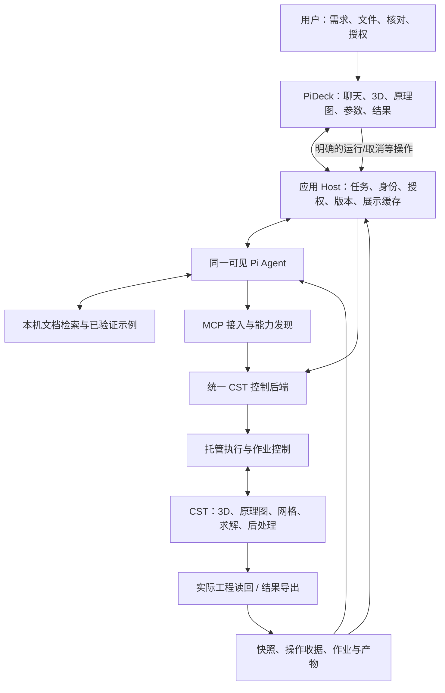
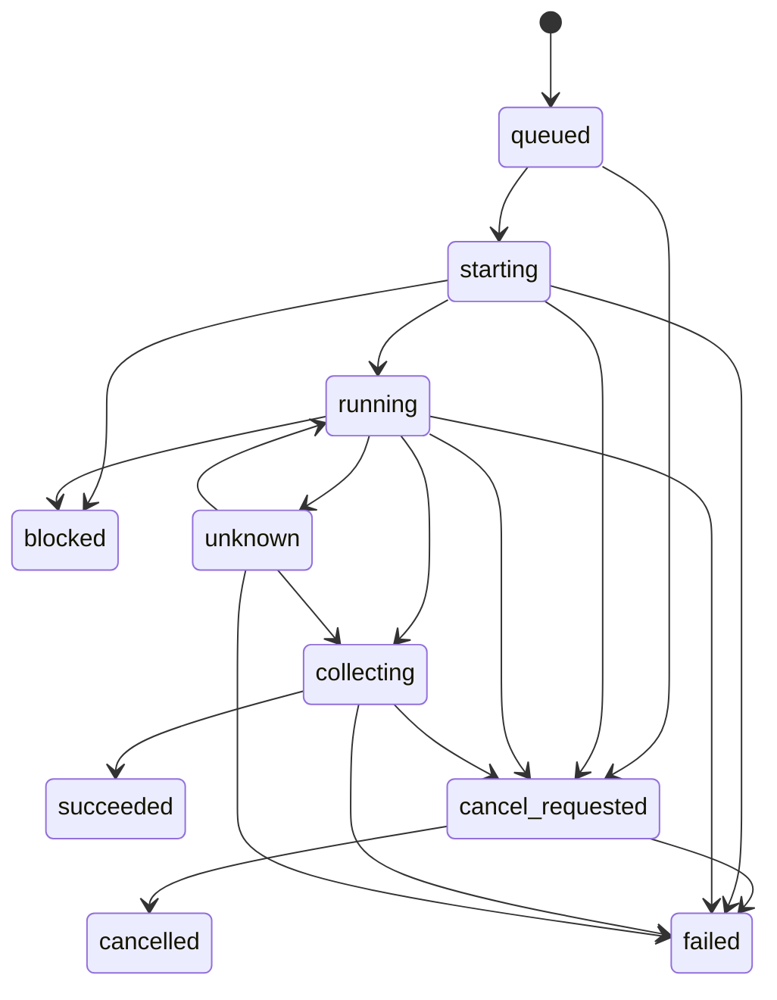

# CST Agent 整体架构与交付方案

| 文档属性 | 内容 |
|---|---|
| 文档编号 | CST-ARCH-001 |
| 版本 / 轮次 | 0.2.0 / R1 |
| 状态 | REVIEWED_CONDITIONAL：有条件接受设计，待负责人冻结首包；不是实现通过 |
| 日期 | 2026-09-20 |
| 远端代码基线 | `14b7f89d28a15b8c64af5c511d95bce1307a60ea` |
| R1 审查输入 | 文档分支最新 HEAD `209828e58b911d542e302cfb0e3b7d7fd9dffdbd`；先 fetch 核验，再在独立 worktree 修订 |
| 配套文件 | [功能矩阵](capability-matrix.md)、[决策与审查记录](review-log.md)、[审查任务](CODEX_REVIEW_TASK.md) |
| 本轮授权 | 方案编写、只读审查、文档提交；不包含开发或求解 |

## 1. 文档用途与证据边界

本文是可持续维护的软件设计文档，供项目负责人、Codex 和 ChatGPT 共同审查。它回答建设目标、模块职责、接口与数据、运行流程、测试验收、阶段依赖和演进方式，不把建议写成既有能力。

全文采用以下事实层级：

- **用户确认**：本次讨论明确的需求与方向，作为设计输入。
- **源码核验**：固定远端提交可确认的实现；不代表已连接真实 CST 验证。
- **本地差异核验**：当前未提交增强的源码/测试，与远端实现分开登记；本轮不将其提交。
- **既有原始证据**：本轮只读核对的历史日志、工程和验收收据；注明生成时间、归属与结论边界，不等同本轮重跑。
- **设计提案**：拟实现的结构、契约、策略和验收条件，等待审查。
- **待验证**：官方接口适用性、版本兼容、性能和物理结果等尚未核实事项。

除第 3 节标注的现状外，本文的“应当”“必须”和拟议模块主要描述目标设计。R1 未启动 CST、MCP 服务或产品 Pi，未做接口探测、Provider 调用和数值测试。只执行文件/版本读取与文档检查。截图原件未随本分支提供：功能矩阵保留 R0 全部可见项转录，但本轮不能宣布已逐像素确认无遗漏。

## 2. 产品目标、用户范围与非目标

### 2.1 产品定位

用户确认的目标是独立 CST 智能仿真工作台：继续使用 **Pi Agent + PiDeck + 现有 CST MCP**，通过自然语言、文件输入和多轮修改完成建模、配置、求解、结果查看与解释；尽量减少正常工作中手动进入 CST 原生界面的需要。

长期覆盖 3D 与原理图的广泛功能，而不是仅支持几个参数化天线模板。优先领域为天线馈电/S 参数/方向图、线缆串扰、腔体内线缆耦合电压电流，车辆 STEP 是复杂几何的一类实例，不是唯一对象。滤波器等保持远期覆盖候选，不改变上述近期领域优先级。

与既有 FDTD 工作台保持交互思路一致，但 CST 不照搬“四个 MATLAB Define”模型结构。CST 工程及依赖是其实际模型状态，代码负责构建和修改记录。

### 2.2 交互要求

根据用户提供的老师需求整理及当前确认范围，软件应支持：必要补问和建议、参数实际值与依据、人工核对、同任务自然语言修改、模型和结果可视化、教材/案例验收。手工编辑代码为可选，不要求用户靠修改代码才能完成日常工作。

这里是需求摘要，不是老师原始消息逐字引用。若本地最新需求记录与摘要冲突，Codex 应标出冲突并提交取舍，不自行恢复旧研究路线。

### 2.3 本阶段非目标

不重新开发通用 Agent Runtime；不增加固定的多 Agent 建模流水线；不创造另一种强制几何 DSL；不重写 CST 几何内核或求解器；不承诺一次性复刻整个原生 UI；不默认启用 Computer Use；不恢复暂停的科研实验；不做未授权的大规模扫参或优化。

文献库、历史研究、失败案例和未提交增强全部保留，但不能代替当前产品需求。功能覆盖与论文创新分别论证。

## 3. 现有基础与关键缺口

本节同时区分远端固定源码、本地未提交差异和既有证据。参考源见第 18 节；下面的工具计数仅为 AST 静态声明计数，不是调用成功数。

| 现有内容 | 核验结论 | 不能据此推出 |
|---|---|---|
| `tools/*.py` + ToolRegistry | 已有参数化工具注册/分发结构 [S1] | 工具声明全部有效、全部真实验收 |
| VBA 建模路径 | Python 组织 VBA，经 `model3d.add_to_history()` 等入口执行 [S2] | 全部功能都是 Python 原生方法 |
| `cst_execute_vba` | 已有原始 VBA 入口和输入检查 [S3] | 已有任意 Python 的完整托管执行器或安全沙箱 |
| VBA 参考查询 | 读取仓库内 `vba_reference.json` [S3] | 实时读取全部官方文档，或参考表已逐项核实 |
| 原理图工具 | R/L/C、外部端口、网络和成员枚举/通用调用已有代码 [S4] | 已覆盖完整 Cable/DS 任务与所有界面操作 |
| 连接与关闭 | 默认可能选择第一个实例/工程；关闭路径存在环境关闭调用 [S2] | 已具有明确会话归属与非侵入式 detach |
| 仿真启动 | 同步与所谓异步经同一执行路径，异步标志不足以证明后台作业管理 [S5] | UI 取消会停止真实求解 |
| 状态/异常 | 部分查询使用 MsgBox；部分异常返回未运行；弹窗自动确认范围较广 [S2,S5,S6] | 查询结果可靠，未知弹窗已安全处理 |
| 结果 | 存在直接导出和读取入口；部分结果转换为字符串；有删除旧结果辅助逻辑 [S2] | 统一结构化数值、来源和当前版本绑定已完成 |
| 测试 | `test_connected_mode.py` 使用 Mock；另有真实测试指南 [S7,S8] | 文件名含 connected 就是实机测试 |
| 服务启动 | `server.run_server()` 在进入 stdio 协议前调用 `client.connect()` | 启动协议测试不会连接或启动 CST |
| 本地新增能力 | 相对远端新增六项工具声明：诊断两项、网格两项、瞬态任务一项、用户波形一项 [L1] | 本地功能已合并远端或经过真实验收 |

### 3.1 R1 本地核验结果

控制代码工作区的 remote 与本仓库一致，仍为 `main @ 14b7f89d28a15b8c64af5c511d95bce1307a60ea`。有五个源码文件、四个已跟踪测试文件的修改，以及一个未跟踪诊断测试；本轮读取前后保护其 HEAD、分支、状态与文件哈希。文档 worktree 不含这些增强，后续实施应选择性审查合入，不从干净 worktree 反向覆盖开发目录。

| 本地差异 | 可复用内容 | R1 判定与缺口 |
|---|---|---|
| `cst_client.py`、`tools/schematic.py` | `schematic_create_transient_task`，创建/设置/ValidateSetup，`update` 默认 false | `update=true` 会调用 `SimulationTask.Update`，不是只保存参数；默认 `cosimulation`/`CSSCHEM1` 不宜照搬简单独立 RLC |
| `tools/solvers.py`、`cst_client.py` | 用户激励与 `.usf` 文件写入 | 保存路径/波形依赖须进入工程清单；写入成功不等于 CST 已采纳或求解成功 |
| `tools/diagnostics.py` | automation guardrails、线缆联合设置文件检查 | 是经验提示和部分先决条件检查；TCF 缺失也可能进入 ready，不能拿 `status=ok` 当联合运行通过 |
| `tools/mesh.py` | 全局近/远区网格、局部实体/mesh group 属性 | 复用生成逻辑，核验单位/适用网格类型/实际读回；未见与这两项增强同时修改的专项测试，不能据此说完全没有旧测试 |
| 相关测试 | 会话、任务、激励、诊断的 Mock/生成代码检查 | 本轮未运行；不把断言代码或缓存当新 PASS |

远端静态声明为 **177** 项，本地为 **183** 项；`CLAUDE.md` 的约107项分类已过时。六项新增的精确名称见功能矩阵。已有 RLC、ExternalPort、Net、通用 schematic 调用属于远端能力，不应重新从零实现。

### 3.2 原始证据的归属

| 证据 ID | 本轮只读取得的事实 | 可支持的结论 |
|---|---|---|
| E1 | 一份既有 MCP stderr 记录连接到运行实例并发现一个打开工程 | 历史连接路径曾进入 connected；没有同收据目标身份、读回及结果链，不能提升整类工具 |
| E2 | 本地场路项目的 2026-07-01 DS 日志记录双向瞬态耦合激活，随后 3D 错误；运行摘要 return_code=1 | 有真实启动和失败证据；不是联合求解成功，更不证明全部经 MCP 驱动 |
| E3 | 多个官方示例副本带 2024 年日志/2025 Beta 标记；部分带浮节点与频带警告 | 只能作为随包参考缓存；不得用文件的近期复制时间冒充本机新运行。一个导出摘要实际为 `{}`，也不构成数值证据 |
| E4 | 既有 PiDeck/FDTD 的恢复及只读不新增 run 原始收据，与9月19日交付记录相符 | 可借鉴会话、相机、版本门和旧结果保留；不证明 CST UI、CST 取消或当前窗口已验 |

当前没有足够原始证据把本方案的 CST 双域绑定、结构化读回、取消、PiDeck 或独立数值验收标为 `pass`。这不是否定已有工作，而是限制本次可对外报告的范围。

仓库 `CLAUDE.md` 的现有返回格式、VBA Builder 和安全规范是需要核对的维护约定 [S9]。本文提出的结构化输出等变更属于待审设计，实施时须同步调整文档/兼容层，不能让新旧规范隐性冲突。

## 4. 软件需求与追踪

### 4.1 功能需求

| ID | 需求 | 可检验的验收方向 |
|---|---|---|
| FR-01 | 文本、论文/PDF、图片、已存在 CST/CAD 文件作为输入 | 记录文件身份、读取范围、页码/位置；无法读取时不编造内容 |
| FR-02 | 必要补问与建模建议 | 已知、用户指定、建议、推断、未知分开；关键歧义阻止相关操作 |
| FR-03 | 代码优先且复用封装 | 既可调用可靠工具，也可提交受控 Python/VBA；不要求逐按钮封装 |
| FR-04 | 3D 建模与修改 | 对象、尺寸、材料、坐标和关系从实际工程读回 |
| FR-05 | 原理图与场路模型 | 元件/引脚/网络/任务可读写；不能只显示线条外观 |
| FR-06 | 参数实际值与来源 | 保留表达式、求值结果、单位、来源和时间；不以聊天记忆代替查询 |
| FR-07 | 仿真配置与真实网格 | 端口、边界、激励、求解器、监视器与网格设置可核对；实际网格独立验收 |
| FR-08 | 可管理的作业 | 启动、进度、失败、取消、恢复及预算；不阻塞界面或停止控制链 |
| FR-09 | 结果获取与展示 | 复数数据/轴/单位/参考约定/模型版本可追溯，旧数据显著标记 |
| FR-10 | 同会话持续操作 | 建模后多轮修改与追问不丢失工程身份；只读追问不触发求解 |
| FR-11 | PiDeck 展示与交互 | 自然语言直接修改为主，点选可选辅助；3D、原理图、设置、运行、结果和解释可联动，修改后读回刷新 |
| FR-12 | 保存、恢复和外部修改协调 | 保存重开状态一致；人工原生修改触发重新核验，不自动覆盖 |
| FR-13 | 按需报告 | 使用已选定版本与已有结果；报告生成不隐式启动求解 |
| FR-14 | 功能广度与扩展 | 显式维护版本/功能覆盖矩阵，按用户操作而非函数数目验收 |
| FR-15 | 自动化失败诊断与有限修正 | 返回可定位证据；保持已确认要求，不无限重试或改目标求通过 |
| FR-16 | 扫参、优化、复杂程序集成 | 逐类扩展，受明确预算/任务依赖/结果身份约束，不由基本运行许可推导 |
| FR-17 | 对话失败、取消与恢复 | Provider 失败/取消对话不等于取消 CST；恢复先呈现真实作业，不能自动重放写操作或求解 |

### 4.2 非功能需求

| ID | 需求 | 约束 |
|---|---|---|
| NFR-01 | 正确性与诚实状态 | 未知、失败、未验证、过期不得编码成成功/零值 |
| NFR-02 | 安全与所有权 | 不改错工程、不误关用户实例、不越权删除/运行/上传 |
| NFR-03 | 可恢复与可重复 | 作业日志持久化；重复请求不重复副作用；恢复先核验状态 |
| NFR-04 | 兼容与隔离 | 固定已验版本组合；CST 与 FDTD 工作区、会话、日志和配置隔离 |
| NFR-05 | 交互与资源 | 长作业返回作业标识；控制面保持可用；大数据按需加载 |
| NFR-06 | 可维护与可审计 | 复用现有实现；源码/文档/测试/产物建立可追踪关系 |
| NFR-07 | 公开数据最小化 | 工程资产、用户材料、许可证相关库和凭据不自动进入公开仓库/Provider；外部转换另需覆盖具体资料与服务的外传授权 |

性能门槛为待标定设计值，不冒充现测值。Codex 应给出小工程上的启动响应、查询延迟、取消确认延迟、峰值内存、导出大小测量方案，再冻结门槛；CST 内部不可控耗时必须单独统计。

## 5. 总体架构与职责

### 5.1 架构图

这是逻辑职责图，不要求每个方框单独部署一个服务。R1 收紧为 **一个 CST 控制后端、一套绑定/写锁/收据**；Host 只管理桌面会话与展示，不再持有第二个 CSTClient。快照与运行记录起步用受控目录内的 JSON/日志，不引入数据库、事件总线、通用调度平台或另一个 Agent Runtime。

首包保留单客户端 stdio，先验证双域绑定/读回。PiDeck 按钮和 Pi 都需要调用时，优先在同一后端复用已装 MCP SDK 的 loopback Streamable HTTP，Pi 适配器与桌面主进程作为两个客户端，**共享控制后端而非共享 stdin**；浏览器渲染进程只经桌面 IPC。绑定ID、权限、写锁不以 MCP session ID 代替。

该集成选择仍需 L1/L2 验证，不能因适配器有 URL 配置就标兼容。服务仅监听 loopback，校验 Origin/每次启动的本地凭据；凭据不传给模型、不写日志。不得由 Host 与适配器各自启动一个 stdio 后端去操作同一工程。HTTP 未验证前继续单客户端，不交付一个伪装成独立可用的停止按钮；也不先另建一套 REST 业务 API。

### 5.2 职责边界

| 模块 | 负责 | 不负责 |
|---|---|---|
| Pi | 理解、补问、查资料、组织代码、解释、基于证据修正 | 自己宣称执行成功、绕过权限、编造实际值 |
| PiDeck/Host | 可见会话、选择上下文、授权、工作区与版本、状态展示 | 隐藏的第二个建模 Agent、独立几何真源 |
| MCP 适配 | 工具发现、参数/结果协议、兼容性处理 | 自己承担完整科学推理，或等同于 CST API |
| CST 控制后端 | 绑定、参数验证、动作分类、作业、执行读回、日志 | 默认相信脚本自报的安全性或结果 |
| 执行器 | 按已批准范围运行脚本/封装；处理阻塞与超时 | 无约束共享用户 Python 全局环境 |
| CST | 真实几何、原理图、电磁配置、网格、求解和后处理 | 替代需求来源记录 |
| 产物存储 | 模型快照、输入代码、运行数据、证据和关联关系 | 竞争建模 DSL 或第二套仿真模型 |

按钮直接触发的保存/运行/停止也走同一控制后端，不强制绕经一次 LLM 调用。MCP 和 Host 不得各维护一个互相不知道的 CST 会话或求解队列。

### 5.3 与既有系统的关系

沿用 Pi 与 PiDeck；暂不切换 LangGraph 或新 Agent 框架。CST MCP 仓库继续作为控制包及本套方案的归属，不在本轮复制整个 FDTD 仓库。实施期采用独立 CST 桌面 checkout/启动配置，基于明确 PiDeck 提交复用外壳；先增加隔离的 `features/cst`、CST类型与主进程桥接，不为两个后端先提炼通用多物理平台。具体落点见第15节。

本地需求新范围已核对：优先自然语言修改、当前参数、依据核对、模型/实际网格分视图及真实结果。文件手改、旧Yee科研和额外Agent不是本阶段前置。FDTD 已批准的自动Mesh及运行预算不转移为 CST 授权；CST后续也可以在明确包范围内连续运行，不需每个工具都弹一次确认。

公开 MCP 包与可能含私有资产的桌面/算例工作区可以分离。不要因文档放在 MCP 仓库就假定所有 UI、工程和数据都应放入公开仓库。

## 6. Code First 与 MCP 的结合方式

### 6.1 为什么不是二选一

MCP 是访问通道；代码是组织工作的方式。推荐策略是“**代码优先 + 已验证封装 + 明确通用调用入口**”，不要求每次操作都写脚本，也不要求把每个按钮做成工具。

常规保存、结果读取、运行和取消使用固定契约；常用建模操作复用现有封装；组合建模、循环、批处理和未单独封装功能由 Pi 编写 Python/VBA。Python 可以组织调用已验证库，VBA 可覆盖适合其对象接口的操作。执行路由必须明确 3D、原理图及相关任务上下文，不能靠任意 AttributeError 自动猜模块。

### 6.2 两类代码不是同一安全等级

**默认模式：已有封装＋明确上下文的 VBA。** 首包复用工具处理器、VBA Builder 和 CSTClient；Pi可用Python组织参数/循环和生成代码，但不因此新增一个接受任意Python源码的“安全执行器”。不引入限制几何表达能力的第二DSL。控制调用由共同后端执行，必须带目标和模块上下文。服务自己产生的只读查询模板可以单独审核，不能为返回数值就全面放开用户宏文件I/O。

**Python 扩展方向保留，但不空宣已受控。** Python直接持有CST原始对象可满足广覆盖，却与强制逐操作门禁有冲突。只有后续明确托管范围后，才提供同一控制进程内的可信Python配方或通过已存在MCP调用组织操作；不在第一包建设代理SDK、解释器和沙箱三套基础设施。原始Python/VBA仍属于下面的受信任高权限通道，不能贴上“受控”标签就绕过运行批准。

**扩展模式：原始 Python/VBA 或通用 RemoteObject 调用。** 这为广覆盖保留出口，但会扩大权限。必须明确标为未验证/高权限调用，按实际最大副作用授权，在工程副本/专用实例和受限工作区验证后再沉淀为正常能力。不把“声明仅建模”或正则过滤当作强制保证。

任意 Python/VBA 一旦得到原始 CST/系统对象，可能绕过细粒度约束。现有 `validate_vba_input` 不阻止 `Solver.Start`、`SimulationTask.Update`；通用 `schematic_call` 只校验公开成员名称，不判断方法副作用。仅靠 AST/关键词、虚拟环境或子进程不构成沙箱。首版不接收不可信第三方脚本，不建设多用户OS沙箱；可信原始代码使用专用副本、记录完整脚本hash并按最大副作用授权。不能确定是否求解的原始调用，在“仅建模”会话中阻断，而不是由代码自报只读。

Pi 自带终端工具同样不能成为绕过控制后端启动另一套 CST 会话的捷径。默认任务路径限制、允许命令和敏感操作授权要贯穿 Host、MCP 与 Runner。

### 6.3 执行语义

每次写操作应携带 `project_id`、`expected_revision`、`operation_id`、代码或参数的内容 hash、动作类型及实际授权引用。跨多条调用的脚本在逻辑阶段形成检查点，不要求每行都做一次 MCP 往返。

执行流程为：读取目标和版本 → 验证输入/权限/预算 → 在逻辑写阶段建立可恢复检查点 → 执行 → 读回并核对后置条件 → 保存收据 → 发布新快照。查询无需复制全工程，每行脚本也无需一个副本。发生部分失败时返回已执行范围、`mutation_may_have_occurred` 和恢复建议；即使返回错误，旧快照/选择也可能已失效。不假装 CST 支持数据库式原子事务。

路由使用明确的 `model3d_history`、`schematic_vba` 或已审核原生方法能力；调用前检查工程是否暴露接口。远端 `execute_vba` 的 AttributeError 回退可能掩盖原域部分执行或产生错误域重放，应替换为预先选路，不能因任意异常再次执行另一域。任务名还要带其父任务/上下文，不能只靠当前激活的窗口。

修改后需要核对的不仅是参数表，还包括参数是否驱动了目标几何/电路。脚本写入日志不等于工程发生预期变化。

## 7. 文档检索与自动化能力库

### 7.1 三种来源分开

1. **本机同版本官方帮助和官方示例**：优先作为 API 参数、单位和调用顺序依据；记录版本、文档相对路径/章节和内容 hash。
2. **运行时接口探测**：确认本机暴露对象/成员；`dir()` 不保证列全动态能力，也不是方法的完整说明书。
3. **本项目参考表与已验证示例**：提供快捷说明与工作配方；必须标来源、支持范围和验证证据，不标成官方全文。

官方介绍可确认 CST 提供 Python 自动化工作流和设计环境职责 [S10,S11]，但不能据此证明每个按钮在本机版本均可脚本化。安装版本的帮助、API 与实机测试共同决定功能支持。

### 7.2 最小检索实现

首版可用本机目录索引与关键词全文搜索，保留文档段落和示例；不先建设复杂向量库。Agent 按任务读取相关材料，避免一次注入全部手册或全部工具定义。

每条可复用示例应记录：能力 ID、适用 CST/项目/求解器版本、所需许可证类别（如可取得）、前置条件、输入/单位、调用序列、预期读回、已知错误、测试和原始证据引用。高频成功路径再提升为封装，不要求先封装完整产品。

帮助、论文和导入工程属于数据来源，不具有改变系统权限的指令效力。第三方宏不得因出现在 PDF/仓库里就直接执行。文档许可及向 Provider 传输范围要先确认；完整官方帮助不提交公开仓库。

### 7.3 Pi 接入策略

优先验证已有 Pi MCP 适配扩展的项目级配置和按需工具发现 [S15]，不要无条件自研新适配器。R1读取的CLI包版本为 **0.85.1**，参考Host嵌入SDK为 **0.80.10**；PiDeck `PiProcess.start` 有 `--mode rpc`、可配置命令和独立cwd，所以包版本不能证明某个活动窗口加载了哪条入口。

适配器源码在 `199b4daaf708bd49e0bab9141255c3cb10f50a58` 声明 **2.34.0**，pi-ai peer为 `^0.84.1 || ^0.85.0 || ^0.86.0`；与CLI声明范围相容，不与0.80.10相容，二者都尚无本任务接入验收。本轮未确认该适配器实际安装/加载；不能写成已安装。首选CST独立项目走现有CLI RPC入口，不升级FDTD内嵌SDK来迁就适配器。

该版本支持项目 `.mcp.json` 及 `.pi/mcp.json` 覆盖，也会读取全局来源。实施时核对最终生效服务清单，只向CST会话开放本任务服务；发现不在批准清单的服务则阻断，不修改用户全局配置。URL配置/按需加载是候选能力，仍需协议测试。版本清单还应包括实际解释器与服务命令；本轮静态环境查询得到Python3.11.9/MCP SDK1.28.1，不证明现有MCP进程使用它们。

## 8. 工程状态、模型版本与数据契约

### 8.1 唯一实际状态依据

当前 CST 工程、关联子工程及必要依赖是模型实际状态依据；脚本、导入文件和修改日志是构建/变更记录；PiDeck 几何与图表是派生显示数据。用户在原生 CST 修改后，必须重新读回、生成外部修改事件并重新确认来源，不允许代码记录覆盖真实工程。

CST 保存可能涉及 `.cst` 之外的项目目录和关联资产。检查点必须覆盖经核验的依赖集合，不能假定复制一个文件就足够恢复。不要把整个工程文件 hash 当作唯一物理模型 hash：保存格式、结果和视图变化可能改变文件字节。

### 8.2 拟议数据对象

以下为目标契约，不是对现有接口字段的描述。

| 对象 | 最小字段 |
|---|---|
| TaskContext | task_id、session_id、输入清单、用户要求、当前选择、审批/预算引用 |
| ProjectBinding | project_id、实例身份/进程启动身份、工程定位、项目类型、版本、owned/attached、依赖 |
| ProjectSnapshot | revision、采集时间、字段覆盖/未支持/未知清单、单位坐标、对象与设置 |
| ParameterRecord | 对象/参数键、表达式、求值、单位、source_kind、来源引用、确认状态、适用 revision |
| OperationReceipt | operation_id、输入 hash、expected/actual revision、已执行步骤、后置条件、错误与产物 |
| RunRecord | run_id、project revision、求解器/任务类型、配置 hash、CST 版本、状态、预算、时间与原始日志 |
| ResultArtifact | artifact_id、run_id、数据路径/hash、数据类型、轴/单位/分量/参考约定、来源和有效性 |
| CapabilityRecord | capability_id、API 证据、版本/模块、读写与 UI 状态、自动化证据、数值证据、缺口 |

应保存参数表达式和解析值，例如长度表达式与其当前毫米值，不能为了校验把所有表达式强转为固定浮点。缺失值使用 `null/unknown` 和原因，而不是零。

### 8.3 标识和变更失效

应用对象 ID 与 CST 中对象路径/名称、类型、必要几何/电路签名建立映射。重命名、布尔运算、删除重建、CAD 重导入可能使映射失效；不能假定 face ID 或名称永远稳定。歧义时使旧选择失效并要求重新确认，不猜选。

几何、材料、网格、端口、边界、激励、求解设置或电路连接变化，应按依赖使有关结果和网格失效。首版可以保守失效，后续再缩小范围；纯视角/颜色/布局变化不应自动触发求解。旧结果保留并标记其版本，不覆盖历史失败。

新快照发布前的晚到读回不能覆盖更新版本。`revision`首先是应用操作序号，**不是已证明覆盖全部CST变化的全局版本**。首包只支持受控独占写窗口；重新绑定、写前和运行前核对可观察字段/依赖，无法证明连续性时标记 `external_change/needs_refresh` 并保守失效。只看文件mtime无法发现未保存的原生修改，局部参数相等也不能证明整个工程未改；后续attached模式遇到未知修改先关闭自动写/运行，要求重新同步。不得假造CST有通用变更订阅。

检查点优先在已保存且不运行的自有工程上生成并核验依赖清单；不能在求解写结果时直接复制目录并称一致快照。不覆盖原件做恢复，先打开独立副本核对。只读追问、视图旋转和报告下载不得产生隐式运行。

### 8.4 结果语义

S 参数保留复数值、频率单位、端口编号/模式/顺序及参考阻抗；方向图说明频率、角度轴、极化、坐标和增益/方向性类型；线缆电压电流说明导线/终端/探针、位置、参考节点与正方向。无法取得的元数据明确缺失，不能靠文件名猜。

同一 run 的扫参点、模式或任务结果也必须区分。远端 `get_result` 固定走 `ProjectFile.get_3d()` 并把对象转为字符串，不能当原理图V/I结果读取器；应分别适配3D与DS结果树，本机帮助确认入口后再实现。读取明确的结果集、任务/扫参点、轴、复数实虚部与单位，不能仅取“最新”同名曲线。

每个run使用新的受控导出目录，记录求解前后状态、输入版本、任务和结果集关联；时间戳/非空CSV均非充分证明。现有export删除同名旧文件及`set_params_rebuild_solve`删除旧结果后求解的组合需拆开权限/证据保存，不能作为普通参数修改默认动作。失败运行允许收集部分结果，但标为incomplete；采集被取消或导出失败不得改写求解器实际结束状态。

## 9. 3D、原理图和线缆的交互设计

### 9.1 3D 视图

从真实 CST 工程导出可显示几何，并绑定对象、材料、坐标和单位。首版提供旋转、缩放、隐藏、选择、尺寸/材料检查和选择对象带入对话。截图可用于错误辅助，不作为唯一精确数据。

三角面片显示网格、原始 CAD 几何和求解网格是不同概念。不能把渲染面片密度称为电磁网格加密。网格不可取得时显示“尚未提供真实网格”，不伪造。

### 9.2 原理图视图

读回元件、属性、引脚、端口、网络、任务和可取得的布局。电气连接图是主要依据，屏幕线条仅是显示；交叉线不默认连接，元件引脚编号/单位按实际接口核验。

首版即使只有连接表和简化可选择网络图，也应真实反映拓扑，不等待高仿 CST 元件图库。后续再增加布局、拖放、连接编辑等交互；视觉布局修改与电路拓扑修改分开管理。

原理图调用不以 3D History List 为必要前提 [S2,S4]；但本文不声称原理图所有行为都有相同历史/撤销支持。组合脚本应记录自身步骤与读回结果，建立可检查的操作轨迹。

### 9.3 场路/线缆绑定

需要明确保持“几何导体/线缆路径 → 端子/端口 → 电路块与引脚 → 网络/负载/参考节点 → 仿真任务 → 观测结果”的对应关系。必须能检查连接对象和方向，不能只凭三维外观判正确。

任务更新、Assembly、Parametric Update 等可能隐式触发重建或求解，按实际副作用纳入权限和预算。不同求解器的任务依赖、暂停/停止和结果树不能直接沿用 Microwave 假设。

### 9.4 PiDeck 信息架构

建议界面包含会话、3D/原理图切换、对象与参数、仿真配置、作业与日志、结果、报告。每个面板明确显示工程与 revision，结果额外显示 run。支持“先审查模型”“仅修改”“运行当前版本”，避免一个按钮隐含不透明的建模加求解。

用户可以临时进入原生 CST 处理尚未支持功能，但应标为人工介入并重新同步，不把该流程计入全自动通过。隐藏 CST 是可选运行模式，需要单独实测；不把 hidden/quiet 当作纯无 GUI、无弹窗或无 Design Environment 的保证。

## 10. 会话、作业与恢复设计

### 10.1 工程所有权

绑定必须包含实例和工程身份，不默认选第一个实例。附着用户实例与系统新建实例区分；detach 不等于关闭应用；只有受控创建且允许关闭的实例才可自动退出。工程路径和 PID 单独使用都不够，需结合实例启动身份与工程核验防止复用错误。

同一工程的写操作串行化并验证 `expected_revision`。初版一项受控写/求解任务占用工程，读取是否可并发由实际 CST 接口决定。多 Pi 会话不能同时无锁修改同一工程。

### 10.2 拟议作业状态

状态图是UI聚合状态，不列出全部恢复转移。持久记录至少分开执行状态、取消状态和采集状态；不必为三者分别建服务。求解完成但采集失败，记录 `execution=completed, collection=failed`；此时再次取消采集不能声称停止了求解。未知弹窗导致的blocked不证明底层已停；保留控制通道并标记实际状态unknown。超时是事件/原因，不能直接推出cancelled。succeeded只表示本作业目标与产物通过工程核验，不表示物理PASS。

### 10.3 真异步与可取消性

长调用从 MCP 请求线程/事件循环分离，迅速返回 job/run ID。需要一个不被阻塞求解调用占满的控制通道；只把函数放进子进程、或停止命令排在阻塞调用之后，都不能证明可取消。

本机Python帮助明确：`Model3D.run_solver(timeout=None)` 等待求解及后处理结束，另有 `is_solver_running`、`abort_solver`；帮助没有证明并发连接可在当前阻塞调用期间抢占。`timeout`也不等于已取消CST。[H1]

建议在CST-1/P1B仅验证一种候选：主控制进程保留队列/日志/预算；执行worker在自己进程内连接明确PID/工程并持有句柄；停止路径用另一个在自身上下文建立的连接。禁止跨进程序列化RemoteObject，不臆测线程安全。只读文件日志可辅助观察，不能代替求解器停止确认。**第二连接也可能被CST串行阻塞，故该机制是带失败退路的试验，不是已成立架构保证。**

若3D或DS任一域无法证实原生取消，分别标记不支持交互取消；不将3D的`abort_solver`用于未核验的DS task。经额外批准的自有进程终止仅记 `cancel_method=terminate_owned_process`，不能算原生取消通过。无法控制的域不进入无人值守长作业，保留受限固定任务/原生人工处理退路。

默认使用求解器或原理图任务对应的已验停止接口；不支持暂停/恢复就明确返回 unsupported。终止进程仅限授权的自有实例及其明确子进程，是最后恢复手段，不可误杀用户其他 CST。MCP 请求取消与真实作业取消分离；所选协议支持任务机制时可映射，但不强制升级协议来开始实现 [S12,S13]。

### 10.4 重试、检查点与重连

`operation_id`相同且内容hash相同的重复请求返回已落盘收据/状态；同ID不同内容拒绝。须先持久化prepared/started，再发有副作用调用，最后落盘完成与读回。CST已执行而收据尚未写完的崩溃窗口无法保证exactly-once：重启标为unknown，先对账，不能自动重放建模或求解。这是持久去重加恢复协议，不宣称分布式事务。

断开聊天不应自动遗弃运行；恢复时核对实例、工程、revision、作业与日志，再显示可继续/已结束/未知。恢复流程不默认再次运行。检查点采用可验证的工程副本及依赖快照，不依赖原生 Undo 能覆盖所有模块。

## 11. MCP 与内部 API 契约

本节为逻辑操作族，不是声称已存在这些方法名。Codex 应优先映射和扩展现有工具，避免平行重复实现。

| 操作族 | 示例职责 |
|---|---|
| capabilities / documentation | 查询已验能力、版本、官方文档段落和示例 |
| project / snapshot | 明确绑定、打开/保存/分离、检查点、实际状态读取 |
| execute / parameter | 提交托管代码或常用修改、参数表达式读写、后置条件验证 |
| model3d / schematic / cable | 明确模块上下文的读写与受控通用调用 |
| job / solver / task | 预检、授权启动、查询、取消、收集任务结果 |
| result / artifact | 结果清单、语义元数据、数值获取与受控导出 |

返回内容至少区分执行模式、状态、目标身份、版本、真实执行与仅生成、证据、错误类别和重试建议。offline/dry-run永远不返回“已在CST完成”；live连接失败不自动退化为脚本生成后继续给成功体验。

兼容方案确定为：先保留旧工具名、`status/message/vba`和TextContent JSON的可解析性，增加身份/证据字段；在注册边界识别失败并返回协议`isError`。只有已迁移工具才声明outputSchema并提供匹配structuredContent；不能全局声明一个实际不满足的Schema，也不把含`status:error`的普通文字视为协议错误。检查未知工具异常路径及SDK实际转换行为。[S1,S9,S12]

默认列举/调用仍基于现有ToolRegistry。参数/端口/状态读回需替换MsgBox/Debug.Print；来自CST的查询异常返回unknown/error，不再当False/零值。无需为统一外观同时重写177个工具。

兼容范围是工具名和可解析响应，不包括继续允许“未绑定自动选第一个工程”或“无运行范围的直接求解”。旧写调用若缺身份/版本上下文，必须在明确的单工程绑定后获得上下文，或返回可识别的升级提示；不能默默猜目标。中文文件路径与中文对象名也分开核验：当前名称校验为ASCII范围，不能把路径测试通过扩张为中文对象写入通过，更不能自动改名已导入对象破坏引用。

stdout 专用于 stdio 协议，日志写 stderr/文件。大型场数据、网格与 CAD 不塞进工具响应或模型上下文；返回已授权 artifact 标识，Host 按需加载，防止任意文件路径读取。

## 12. 资源、权限与部署

### 12.1 初版运行环境

首版面向本机 Windows、已安装并获许可的 CST。按配置定位安装和工作目录，不在源码中硬编码个人路径。版本清单应包含 OS、CST build、Python 与 CST 库来源、Pi CLI/内嵌 SDK、适配器、MCP 包、桌面构建和实际启动配置；取不到的项标记未知。

环境检查不等于版本升级，也不自动启动求解。远程服务和多用户部署列为后续设计，不能沿用本机信任假设直接对外开放。

### 12.2 授权与预算

只读查询、普通修改、生成网格、求解、扫参/优化、破坏性操作分级。用户可批准一次里程碑预算内的连续执行，避免逐小步确认；批准“建模”不隐含求解，批准一次仿真不隐含无限优化。

预算应覆盖时间、并发、内存/磁盘、网格规模、求解次数和可取得的许可证资源。采用预估加运行期监控；预估未知或无法强制某项上限时先声明并选择更小试验，不宣称绝对保证不耗尽资源。不得为满足预算静默改变用户尺寸、材料、边界、网格或目标。

### 12.3 弹窗、文件与数据

已确认无害且与绑定实例/操作匹配的弹窗才允许自动处理；未知、许可证、覆盖保存和物理兼容警告需记录并按策略阻断。不要全局扫描后盲点 Yes/Continue。

导入、保存、导出和宏文件均做工作区授权、规范路径与覆盖检查，考虑 Windows junction/symlink。临时删除旧结果前保存可恢复证据；不能为了“结果新鲜”销毁唯一失败样本。隐藏窗口模式的异常检测是单独验收项。

公开仓库不包含官方完整帮助/库、受限模型、用户原始材料或凭据。向外部模型发送论文图文/几何摘要应有明确授权边界；没有数据可外传授权时使用可公开示例或本地处理。

文件读取与外部转换分开：第三方OCR/转换服务需要覆盖**具体资料及具体服务**的外传授权；安装Skill、已有凭据或要求读取文件不构成授权。未授权时不发送文件、摘录、图片或供服务抓取的URL，优先本地可用解析。公开文档中仅存脱敏证据ID和源码/帮助章节定位，不写个人绝对路径或原始日志。

## 13. 分层测试与证据

### 13.1 测试层次

| 层次 | 测试内容 | 合格证据 | 不能替代 |
|---|---|---|---|
| L0 静态/单元 | 输入、单位、生成代码、异常、状态机、失效与重试 | 可重复的断言与日志 | 真实 CST |
| L1 协议 | 以显式offline/no-connect模式启动协议进程，测试发现、调用、Schema、错误、断连；live协议另需CST授权 | 既有SDK协议客户端优先，Inspector可选 [S14] | 真实CST和物理正确性 |
| L2 真实接口 | 无 LLM 固定脚本控制 CST，写后读回、保存恢复、运行/取消 | 工程和依赖、实际值、日志、产物及版本 | 自然语言理解 |
| L3 Agent/桌面 | 实际 PiDeck 中自然语言建模、两轮修改、追问、授权、结果 | 实际窗口构建身份、Pi 会话轨迹、工具与工程对应 | 独立电磁基准 |
| L4 物理/数值 | 对照独立参考，检查端口/终端条件与收敛 | 预先冻结的模型条件、指标、误差与原始数据 | 所有未测配置的正确性 |

固定脚本接口验证应先于同范围Agent测试：固定脚本失败先查后端，通过而Agent失败再查提示、资料和决策。L0/L1先行，无需等全仓L2完成才做局部UI。本地UI静态/组件测试也不要求先求解。CI默认无CST/无Provider。

当前`run_server()`无无连接开关且会调用connect；必须先改成显式启动策略/惰性连接，才可进行上述L1。仅设置错误CST路径或Mock fixture不能保证新服务进程不启动CST。本轮因此没有运行pytest、Inspector或服务。后续协议测试复用已安装SDK，不以安装新工具为前提。

### 13.2 首批案例

| ID | 作用 | 范围与通过标准 |
|---|---|---|
| C0-3D | 最小几何/工程接口 | 从空工程创建简单实体、参数化修改、读回尺寸材料、保存重开；无需全波求解 |
| C0-SCH | 最小原理图接口 | 从空原理图创建 R/L/C、端口、参考节点和网络；核对属性、连接与任务表达；先不求解 |
| C1-ANT | 3D 用户闭环 | 小偶极子：需求、馈电/边界/监视器、两次修改、网格、授权求解、S11/方向图 |
| C1-SCH | 原理图用户闭环 | 参数完全确定的简单电路任务：创建/修改/读回/授权运行/结果，独立电路计算作参照 |
| C2-XT | 线缆闭环 | 两线串扰，核对主扰/受扰、回流、端接、方向、近远端观测 |
| C3-ENC | 场路扩展 | 简单金属腔体或 STEP + 线缆耦合 V/I，再扩展车辆 |

以上是拟议验收案例，不是已通过案例。官方偶极子/已有工程可作为参考候选，使用前核对版本、参数、依赖、授权与参考来源。简单 RLC 数值任务和复杂 Cable/3D 联合任务必须区分，前者通过不证明后者通过。

每个重要案例应同时有“打开基准工程操作”和“从空工程独立构建”两条测试。具体几何、频段、网格、源与观测在案例卡中事先冻结，不在测试失败后随意改变。

### 13.3 故障与负向测试

必须覆盖：双实例/双工程误绑定、过期 revision、重复请求、发送后断线、部分执行失败、同工程并发写、查询异常、未知弹窗、中文与带空格路径、保存重开、CST 意外关闭、求解中取消、停止失败、旧结果残留、外部修改、预算超限、日志或输出缺失，以及只读追问/下载不得引发求解。

取消测试应使用足够长或可控的测试任务确认真实停止；任务恰好结束不算取消成功证据。重复修改测试检查对象数和实际状态，不只检查 API 返回。

### 13.4 数值与自动化分开评判

与人工审核 CST 工程一致主要证明自动化一致；与解析/独立求解/实测一致提供独立物理证据，两者不混淆。解析方法的适用条件和测量/参考误差也须记录。黄金答案不得由同一待测生成代码自行产出。

容差按具体量和参考条件冻结：复数 S 参数、dB 曲线、方向图、时域 V/I 分别定义；避免在近零参考值处使用不稳定的相对误差，避免对深零陷只用统一 dB 阈值。可结合绝对/归一化误差与特征指标，具体由案例决定。需要网格/时间或求解器收敛检查时明确运行预算。

工程完成、真实 Agent 交付、用户体验确认、数值通过四种结论分别记录。物理 FAIL 不阻止诚实展示真实结果，但阻止标为物理验收通过。

### 13.5 证据包与指标

每次测试保存输入、代码/参数、branch/HEAD/dirty、运行组件版本、任务与模型身份、工程/依赖清单、原始工具/求解日志、实际读回、结果、失败重试、人工干预、耗时和可取得用量；未知不填零。

覆盖指标分别统计 API 有依据、可读取、可写入、实机自动化、PiDeck 可用和独立数值验证。分母是已定义范围，不是产品全部按钮的未知总数。另测静默错误放行、恢复成功、陈旧结果误用与人工干预，不只报告成功率。

## 14. 分阶段交付与停止条件

| 里程碑 | 依赖 | 交付物 | 验收门 |
|---|---|---|---|
| CST-0 设计冻结 | 本文 R0 | Codex 本地审查、R1 修订、复核记录、首包范围/预算建议 | 无未解决的当前范围/安全/核心可行性矛盾；负责人批准实施 |
| CST-1 后端双域基础 | CST-0 | 绑定、读回、契约、检查点、任务控制最小实现，C0-3D+C0-SCH | L0/L1/L2 对应断言通过；工程不误改；控制路径可用 |
| CST-2 Pi/PiDeck 双域交互 | CST-1 | 项目级接入、文档检索、3D 与原理图最小展示、参数依据、多轮修改 | 实际同一 PiDeck 完成两域建模/修改/追问，版本一致 |
| CST-3 双域运行与结果 | CST-1/2 | C1-ANT+C1-SCH、真实作业/取消/恢复、结果与报告 | 自动化验收和数值验收分别出结论；陈旧结果不冒充当前 |
| CST-4 线缆与腔体 | CST-3 | C2-XT、C3-ENC、线缆—电路—任务—结果绑定 | 小案例贯通，再批准复杂车辆；资源预检与对照有效 |
| CST-5 广覆盖演进 | 已验基础 | 按功能矩阵逐类完成扫描/优化/图库/依赖/装配等 | 每项有适用范围、读写/UI/实机证据；不靠通用入口宣布全覆盖 |

### 14.1 推荐第一个交付包：CST-1/P1A 双域绑定与读回

**代码范围**：改`server.py/config.py`的offline/live与惰性连接；在`CSTClient`复用3D/schematic逻辑，补明确绑定、非关闭detach、显式执行域和覆盖范围有限的读回；调整`project.py/parameters.py/schematic.py`及注册边界的身份/错误兼容。一个小的binding/receipt辅助模块足够，不先拆出五个服务。保护并选择性复用L1本地增强；未经审查不整包合入。

| 案例 | 建议的冻结测试规格（不是用户仿真需求） | 首包验收 |
|---|---|---|
| C0-3D | 独立MWS副本；mm单位；一个PEC砖，参数L=10、W=5、H=2；先改L到12，再改W到6 | 实际表达式/求值、对象数、包围盒、材料与单位对应；无关设置不变；保存重开；过期/重复请求不重复副作用 |
| C0-SCH | 独立DS副本；R=50Ω、L=10nH、C=1pF、一个ExternalPort及Ground；明确串联支路引脚；先改R到75Ω，再改C到2pF | 实际属性/本地单位、block类型/引脚/Net连接读回；保存重开；断开/错误引脚有反例。首包不创建会执行的task，也不沿用Cable默认cosimulation |

方法签名与组件可用性必须先从本机帮助和已选模板核对；若Ground/属性读回不可取得，则记录C0-SCH阻塞，不能改成只看元件计数后通过。两案例各做从零创建与重开参考副本；参考副本由固定脚本/人工审查形成，不从官方包缓存推断新求解通过。

**验收条件**：L0/L1的offline进程绝不连接CST；live模式错误不伪装offline成功；双工程/双实例身份拒错；owned/attached关闭行为分开；查询异常保持unknown；失败后已变更状态被标识；同ID重复/断连恢复不盲重放；原件不覆盖；输出兼容原TextContent客户端。两域均提供结构化快照及覆盖/缺失字段清单。没有PiDeck、Provider或数值PASS要求，不为首包增加3D编辑器、原理图拖拽、Python沙箱或全部183项回归。

**预算建议，非本轮授权**：实现约2–4个开发工作日，按实际代码/依赖评估调整；L0/L1无CST、无Provider。获准L2后，单次只进行一个案例，身份负测最多两个专用CST实例，最多4次实例启动、两域各不超过3次完整构建/保存/重开尝试；每次等待上限5分钟，整批实机窗口30分钟。Provider调用0、网格生成0、求解0。建议每自有进程树4GiB、整批新产物512MiB的监控停止阈值；不是内核级硬保证，若启动开销已超阈值或许可证不容许双实例，先报告并调整批准预算，不绕过测试。超时后确认副作用与自有进程状态再决定重试，不能按次数自动连跑。

### 14.2 下一技术门：CST-1/P1B 控制路径验证

P1A通过后、完整UI之前，单独批准3D和DS各一个小任务的运行/状态/停止探针。建议求解启动总计不超过6次，每次≤5分钟，实机总窗口≤30分钟，Provider为0；工程、频段、数值设置和资源阈值预先冻结。一个自然瞬间结束的任务不能证明取消成功，不为造取消窗口擅自加大模型。

3D验证H1的原生abort及执行连接隔离；DS先查该任务真正的停止入口，没有就标unknown/unsupported并阻止无人值守长任务。MCP请求取消、Provider中断、worker退出、求解真正停止分别记录。超出10秒仍未确认停止，UI进入unknown/需处理；是否允许在30秒后终止自有进程树必须在本包批准时明确，否则只报警保留现场。自然完成与取消竞态按真实终态判定，不能“请求成功”即cancelled。

P1B失败不推翻P1A的建模读回成果，但阻止相应域的自动长作业交付。CST-2可以在所需子功能稳定后交付小型模型/网络视图，不要求全部接口完成；实际Run入口依赖相应域P1B通过。CST-3的独立数值验收另定参考、容差和次数。

每包批准后在范围和预算内连续实现、调试、验证，不逐小项请示。只有需求冲突、重大架构改变、权限扩大、超预算或破坏性恢复需集中确认。非阻塞问题带入待办；未验证能力留在矩阵，不以纸面审查拖延实际交付。

## 15. 迁移与代码组织建议

不删除或替换现有 MCP。先梳理 ToolRegistry、CSTClient、工具处理器、validators、参考数据和测试；把重复的执行/结果逻辑逐步收敛到共同后端，原有工具通过适配层复用。

以下为R1文件级落点，属于后续实现提案，本轮均未改：

| 位置 | 处理 | 取舍 |
|---|---|---|
| `src/mcp_cst_studio/server.py`、`config.py` | 修改启动/连接模式；集成阶段再接SDK现有loopback transport | 不另造Agent Host或协议框架 |
| `cst_client.py`、`tools/project.py` | 显式实例/工程绑定、归属、detach、未知状态；复用已有project factories | 不依赖第一个实例，工厂缺失不静默回退MWS |
| `tools/parameters.py`、`schematic.py`、`vba.py`、`validators.py` | 改读回与域路由，复用RLC/Net/Builder；通用调用按副作用分类 | 不先设计大代理SDK；不降低现有文件/宏验证后称安全 |
| `tools/simulation.py`、`results.py`、`dialog_handler.py` | P1B起收敛作业路径、域结果适配、绑定实例的弹窗策略 | 不以线程包装代替取消验证；不默认清除唯一历史结果 |
| `tools/__init__.py`及原测试目录 | 渐进错误/结构化输出兼容，沿用测试框架 | 根CLAUDE的旧约定/计数后续同实现PR更新，本轮不改 |
| 独立CST桌面checkout的`desktop/src/main/pi/PiProcess.ts`及AgentManager接点 | 复用CLI RPC/cwd/会话；CST专用环境、服务端点和主进程桥接 | 不带入FDTD端点默认值，不改FDTD生产checkout |
| 独立桌面的`features/cst`、CST共享类型/接口 | 借鉴`FdtdModelViewer.tsx`、`useFdtdScopedRequestGate.ts`、`CodeFirstResultsPanel.tsx`的相机、过期门、曲线/报告交互 | 现组件直接依赖`shared/fdtd`、primitive和FDTD API，不能直接换标签即用；只抽有真实复用价值的小函数 |

首个3D视图可用实际读回尺寸生成简单实体，加经验证的逐对象CAD显示导出；保留单位/坐标/对象映射。整场STL丢失材料/对象语义时，用单独元数据补齐，不把三角面片当求解网格。首个原理图视图为可选中block/net的表和简图，必要时自动布局；不实现全套器件图库/原生编辑器。后续再支持布局读回，读取不到时标“派生布局”而非声称原生布局已同步。

先支持已验证版本；旧返回结构需要迁移策略。升级 Pi、MCP SDK 或 CST 与业务改造分开记录和测试。桌面及 MCP 独立构建版本共同写入运行收据；仅磁盘源码更新不代表当前窗口已加载。

## 16. 风险、未知项与取舍

| 风险 | 处理策略 | 需要的验证 |
|---|---|---|
| 文档或方法存在但本机不可用 | 记录版本/模块/许可证，最小例验证 | 本机帮助+调用读回 |
| 任意代码绕过控制 | 受控代理默认；高权限出口显式授权和隔离 | 越权/逃逸/副作用负向测试 |
| 求解阻塞导致无法停止 | 控制通道与执行分离，不假设线程安全 | 真运行/取消/断线测试 |
| 模型显示与实际工程不一致 | 读回快照驱动 UI，版本与对象映射校验 | 修改、重命名、重导入测试 |
| 原理图画对但接错 | 读回网络、引脚、任务与观测映射 | 拓扑断言和独立电路参考 |
| 导入大型 STEP 耗尽资源 | 准入/预算/渐进案例，未知预估明确提示 | 小模型测量后递增 |
| 错误被自动弹窗或字符串返回掩盖 | 结构化错误、未知状态、白名单弹窗 | 故障注入 |
| 各模块均通过但跨模块失败 | 同一用户闭环与保存恢复测试 | C1/C2/C3 集成验收 |
| 规划不断膨胀 | 固定当前交付包，远期进入功能矩阵 | 每轮注明新增范围与成本 |
| 公开仓库泄漏受限资料 | 原创/脱敏文档、元数据索引、私有证据存储 | 提交前敏感内容检查 |

首轮重点未决问题在 `review-log.md` 登记。本文不伪造运行时完整 API 清单、原理图全覆盖率、当前本机性能或最终创新结论。

## 17. 文档维护与协作规则

同一套文档滚动更新：主方案负责当前设计，功能矩阵负责范围/证据，审查记录负责决策变化，不新增平行“最终版”。需求编号、能力编号与验收编号保持稳定；删除需求改为 superseded 并说明替代项。

每轮审查明确“同意/修改/反对/待实验”，提供证据与替代方案，不仅润色措辞。Codex 在本地核验后可以直接修订本套文件，Git 保留 R0；反对项记录理由，不能为迎合上一轮建议强行采用。

R0 → Codex R1 → ChatGPT 复核 → 负责人确认。审查轮次只对相应提交负责；本轮不自动建立监控服务或调用其他会话。实现阶段每次重要设计变化同步更新方案及相应测试，不把全部实现日志堆进总方案。

当前独立文档分支不合并 main、不混入生产代码、不修改 FDTD 工作区。需要公共入口或仓库规范变更时在审查中提出，待确认后统一调整。

## 18. 来源与核验范围

### 18.1 需求来源

U1：2026-09-20 项目负责人在本次讨论确认：独立 CST Agent、Pi/PiDeck、现有 MCP、3D 与原理图广覆盖、代码优先与可靠封装结合、GitHub 方案迭代。

U2：项目负责人提供的 Codex 会话记录，包含老师需求摘要、既有本地审计、研究暂停与产品优先调整。仅作为历史/需求输入，不把本地状态或数值复述成此次实测。原始会话不上传公开仓库。

U3：两张用户提供的 CST 工具栏截图；功能矩阵记录其中可见名称。截图未展示的下拉项、其他标签页细项和版本不擅自推定。

### 18.2 固定版本源码

下列源码均以 `14b7f89d28a15b8c64af5c511d95bce1307a60ea` 为准；文件位置是可核验依据，代码存在不等于功能验收。

- [S1 工具注册](https://github.com/guardianer9-debug/cst-studio-orchestrator-mcp/blob/14b7f89d28a15b8c64af5c511d95bce1307a60ea/src/mcp_cst_studio/tools/__init__.py)
- [S2 CSTClient：会话、执行、原理图、求解、结果](https://github.com/guardianer9-debug/cst-studio-orchestrator-mcp/blob/14b7f89d28a15b8c64af5c511d95bce1307a60ea/src/mcp_cst_studio/cst_client.py)
- [S3 VBA 查询与执行](https://github.com/guardianer9-debug/cst-studio-orchestrator-mcp/blob/14b7f89d28a15b8c64af5c511d95bce1307a60ea/src/mcp_cst_studio/tools/vba.py)
- [S4 原理图工具](https://github.com/guardianer9-debug/cst-studio-orchestrator-mcp/blob/14b7f89d28a15b8c64af5c511d95bce1307a60ea/src/mcp_cst_studio/tools/schematic.py)
- [S5 仿真工具](https://github.com/guardianer9-debug/cst-studio-orchestrator-mcp/blob/14b7f89d28a15b8c64af5c511d95bce1307a60ea/src/mcp_cst_studio/tools/simulation.py)
- [S6 弹窗处理](https://github.com/guardianer9-debug/cst-studio-orchestrator-mcp/blob/14b7f89d28a15b8c64af5c511d95bce1307a60ea/src/mcp_cst_studio/dialog_handler.py)
- [S7 Mock connected 测试](https://github.com/guardianer9-debug/cst-studio-orchestrator-mcp/blob/14b7f89d28a15b8c64af5c511d95bce1307a60ea/tests/test_connected_mode.py)
- [S8 既有实机测试计划](https://github.com/guardianer9-debug/cst-studio-orchestrator-mcp/blob/14b7f89d28a15b8c64af5c511d95bce1307a60ea/docs/AGENT_TEST_PLAN.md)
- [S9 现有开发约定](https://github.com/guardianer9-debug/cst-studio-orchestrator-mcp/blob/14b7f89d28a15b8c64af5c511d95bce1307a60ea/CLAUDE.md)

### 18.3 外部一手资料

下列页面于 2026-09-20 查询。只用于支持相应通用机制，不证明本机安装/版本组合可用；不以网页版本强制升级项目。

- [S10 Dassault Systèmes：CST Python 自动化工作流介绍](https://events.3ds.com/cst-studio-suite-electromagnetic-simulations)
- [S11 Dassault Systèmes：CST Electromagnetic Design Environment](https://www.3ds.com/products/simulia/cst-studio-suite/electromagnetic-design-environment)
- [S12 MCP Tools 规范：Schema、结构化输出与错误](https://modelcontextprotocol.io/specification/2025-11-25/server/tools)
- [S13 MCP Cancellation 规范](https://modelcontextprotocol.io/specification/2025-11-25/basic/utilities/cancellation)
- [S14 官方 MCP Inspector](https://modelcontextprotocol.io/docs/tools/inspector)
- [S15 Pi MCP Adapter 项目 README](https://github.com/nicobailon/pi-mcp-adapter)

### 18.4 R1 本地只读核验登记

下列路径以仓库/安装目录/参考工作区角色为根，不含个人绝对路径；原文件及完整内容只留本机。H类是官方文件存在及内容核验，**不是本轮API探测**。

| ID | 版本、定位或摘要 | 证据边界 |
|---|---|---|
| L1 | 控制工作区上述main基线；`cst_client.py`、`tools/{diagnostics,mesh,schematic,solvers}.py`及5份测试差异 | 未提交；文件哈希保护收据留本机；不公开补丁/个人内容 |
| H1 | CST2025 `Online Help/Python/source/cst.interface.html`：Model3D.run_solver/abort_solver/is_solver_running、Project.schematic、DesignEnvironment.new | run_solver含后处理且阻塞；gui_linux只说明Linux；无并发停止保证 |
| H2 | CST2025 `Online Help/mergedProjects/VBA_DES/special_vbacommands/`：simulationtaskobject.htm、blockobject.htm、net_object.htm、externalportobject.htm、circuitprobeobject.htm | Update执行本任务及子任务；ValidateSetup核验设置；属性/签名须按具体类型继续核对 |
| H3 | CST2025 `Online Help/advanced/commandlineoptions.htm`、安装Python `cst/interface/studio.py` | -hide为后台启动；quiet与隐藏不等于纯求解器/无DesignEnvironment |
| P1 | CLI包0.85.1；参考Host package.json的pi-* SDK0.80.10；Python3.11.9的安装元数据中mcp1.28.1 | 不是活动桌面/服务的加载身份；适配器实际安装状态未确认 |
| P2 | 参考桌面相对文件`desktop/src/main/pi/PiProcess.ts`、`desktop/src/renderer/src/features/fdtd/{FdtdModelViewer,CodeFirstResultsPanel}.tsx`、`useFdtdScopedRequestGate.ts` | 可复用代码/交互基础，不证明CST支持；当前窗口未重新检查 |
| U4 | 本地老师需求重规划及后续用户范围、9月19日产品记录 | 优先自然交互/参数依据/展示；旧科研与手改非前置；不上传原始会话 |
| E1 | 历史MCP连接stderr | 仅连接事实；PID和个人路径不公开 |
| E2 | 场路失败DS日志SHA256 `A61C0BA9747D93BC86D7903DA4970254CB697285A31DA27E1D9F2763CC1143C1`及配套运行摘要 | 原始文件私存；本轮只读，真实失败不改判 |
| E3 | 官方示例副本的2024日志与空导出摘要 | 缓存不能归因当前MCP；不上传示例/日志全文 |
| E4 | 参考FDTD工作区`test-evidence/harness/auto-mesh-20260919/{readonly-no-rerun-v2,restore-check}.json` | 既有恢复/只读无新run证据，不是CST或本轮新测试 |

S15在本轮另核对固定提交`199b4daaf708bd49e0bab9141255c3cb10f50a58`的README/package.json。官方资料、私有工程、原始收据和安装库不随本次文档提交；本机许可证类型/可用额度、当前CST可执行文件实际build、远程对象并发性仍为unknown。历史运行日志的2025.2 build不能替代当前安装build测量。
