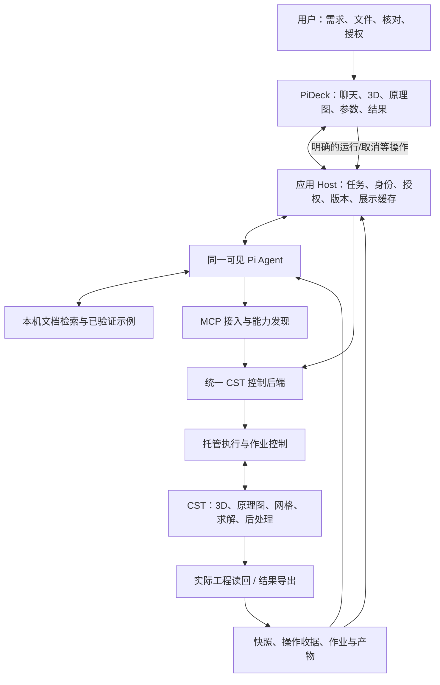
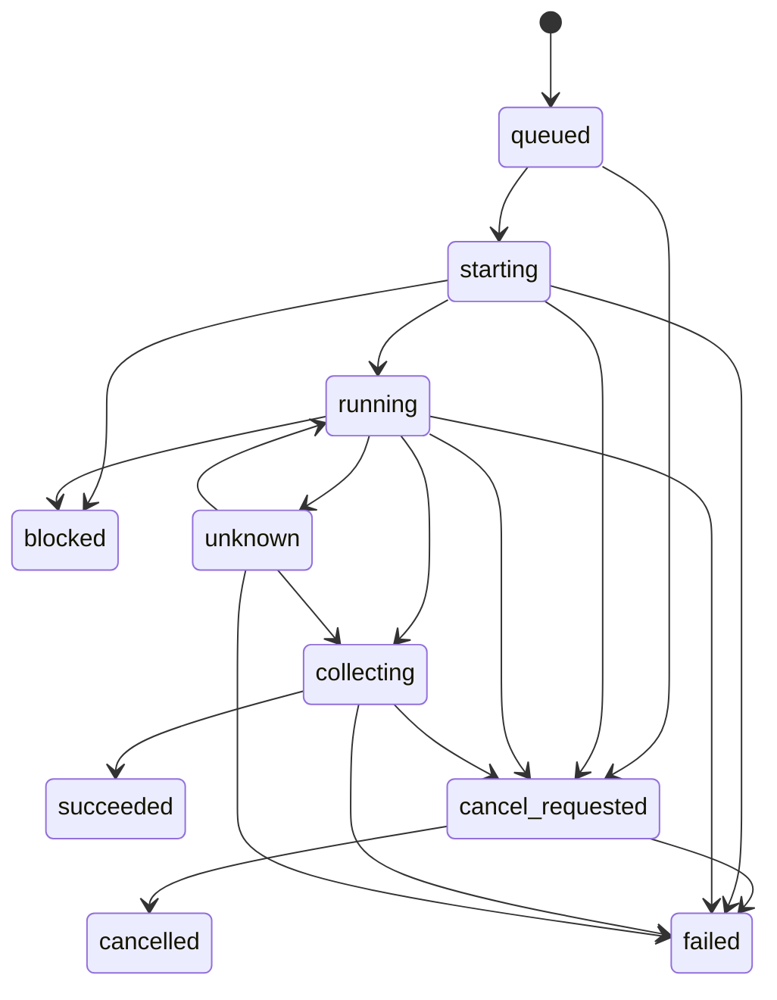

# CST Agent 整体架构与交付方案

> **W3当前交付**：用户已人工检查上轮工程并反馈“基本满意”；仅记录为工程检查基本认可，不代表新结果、数值精度或全部工作台验收。沿用现有架构，本轮完善手动编辑→实际Pi读/改→界面同步→保存重开，继续禁止新网格/task/求解。

| 文档属性 | 内容 |
|---|---|
| 文档编号 | CST-ARCH-001 |
| 版本 / 轮次 | 0.6.0 / W3（工作台编辑与实际Pi接续） |
| 状态 | 开发进行中；原生只读/保存重开与手动参数版本测试有证据，完整工作台和人工验收未完成 |
| 日期 | 2026-09-21 |
| 本轮同步基线 | `15c708b81d8d268a38141c510413aece9e8eceb8`，已快进合入实施分支，原始脏工作区保留 |
| R1 审查输入 | 文档分支最新 HEAD `209828e58b911d542e302cfb0e3b7d7fd9dffdbd`；先 fetch 核验，再在独立 worktree 修订 |
| S1更新基线 | 远端 `5a0a00456acdbe740c43313de344cea25118bdfe`，历史选例补充已在D1–D3承接；原文档worktree未提交内容仍保护保留 |
| 配套文件 | [功能矩阵](capability-matrix.md)、[决策与审查记录](review-log.md)、[审查任务](CODEX_REVIEW_TASK.md) |
| 本轮授权 | 代码/UI、独立副本建模读回保存及必要Pi测试；禁止新求解/网格/task；提交脱敏代码文档 |

**2026-09-20当前决定：** 项目负责人要求持续实现和排错，直至指定的222孔缝腔体线缆耦合及已选官方算例能够自动化复现。P1A/P1B是内部技术检查点，不是每包交付后暂停等“继续”的边界。砖/RLC可以用于定位问题，但不代替真实案例。该句所述S1方案轮次已结束；D1–D3已进入授权开发、真实CST和实际Pi/PiDeck测试，证据见交付台账。旧R1首包范围和预算由第14.1节新口径替代。

> **W2（2026-09-21，当前优先级）**：先交付222原始工程、实际修改过程和稳定会话目录。本轮暂停新的自动网格、task和求解，不提高222预算重试。正常路径为“建模/修改 → 实际读回 → 保存完整工程 → 人工检查/运行”。运行能力保留；需要求解的验收仍待验证。本条覆盖下方历史轮次继续自动运行的要求。

## 1. 文档用途与证据边界

本文是可持续维护的软件设计文档，供项目负责人、Codex 和 ChatGPT 共同审查。它回答建设目标、模块职责、接口与数据、运行流程、测试验收、阶段依赖和演进方式，不把建议写成既有能力。

全文采用以下事实层级：

- **用户确认**：本次讨论明确的需求与方向，作为设计输入。
- **源码核验**：固定远端提交可确认的实现；不代表已连接真实 CST 验证。
- **本地差异核验**：当前未提交增强的源码/测试，与远端实现分开登记；R1轮未将其提交；D1已在独立开发分支保护、整合并提交。
- **既有原始证据**：本轮只读核对的历史日志、工程和验收收据；注明生成时间、归属与结论边界，不等同本轮重跑。
- **设计提案**：拟实现的结构、契约、策略和验收条件，等待审查。
- **待验证**：官方接口适用性、版本兼容、性能和物理结果等尚未核实事项。

除第 3 节标注的现状外，本文的“应当”“必须”和拟议模块主要描述目标设计。R1 未启动 CST、MCP 服务或产品 Pi，未做接口探测、Provider 调用和数值测试。只执行文件/版本读取与文档检查。截图原件未随本分支提供：功能矩阵保留 R0 全部可见项转录，但本轮不能宣布已逐像素确认无遗漏。

## 2. 产品目标、用户范围与非目标

### 2.1 产品定位

用户确认的目标是独立 CST 智能仿真工作台：继续使用 **Pi Agent + PiDeck + 现有 CST MCP**，通过自然语言、文件输入和多轮修改完成建模、配置、求解、结果查看与解释；尽量减少正常工作中手动进入 CST 原生界面的需要。

长期覆盖 3D 与原理图的广泛功能，而不是仅支持几个参数化天线模板。优先领域为天线馈电/S 参数/方向图、线缆串扰、腔体内线缆耦合电压电流，车辆 STEP 是复杂几何的一类实例，不是唯一对象。滤波器等保持远期覆盖候选，不改变上述近期领域优先级。

与既有 FDTD 工作台保持交互思路一致，但 CST 不照搬“四个 MATLAB Define”模型结构。CST 工程及依赖是其实际模型状态，代码负责构建和修改记录。

### 2.2 交互要求

根据用户提供的老师需求整理及当前确认范围，软件应支持：必要补问和建议、参数实际值与依据、人工核对、同任务自然语言修改、模型和结果可视化、教材/案例验收。手工编辑代码为可选，不要求用户靠修改代码才能完成日常工作。

这里是需求摘要，不是老师原始消息逐字引用。若本地最新需求记录与摘要冲突，Codex 应标出冲突并提交取舍，不自行恢复旧研究路线。

### 2.3 本阶段非目标

不重新开发通用 Agent Runtime；不增加固定的多 Agent 建模流水线；不创造另一种强制几何 DSL；不重写 CST 几何内核或求解器；不承诺一次性复刻整个原生 UI；不默认启用 Computer Use；不恢复暂停的科研实验；不做未授权的大规模扫参或优化。

文献库、历史研究、失败案例和未提交增强全部保留，但不能代替当前产品需求。功能覆盖与论文创新分别论证。

## 3. 现有基础与关键缺口

本节同时区分远端固定源码、本地未提交差异和既有证据。参考源见第 18 节；下面的工具计数仅为 AST 静态声明计数，不是调用成功数。

| 现有内容 | 核验结论 | 不能据此推出 |
|---|---|---|
| `tools/*.py` + ToolRegistry | 已有参数化工具注册/分发结构 [S1] | 工具声明全部有效、全部真实验收 |
| VBA 建模路径 | Python 组织 VBA，经 `model3d.add_to_history()` 等入口执行 [S2] | 全部功能都是 Python 原生方法 |
| `cst_execute_vba` | 已有原始 VBA 入口和输入检查 [S3] | 已有任意 Python 的完整托管执行器或安全沙箱 |
| VBA 参考查询 | 读取仓库内 `vba_reference.json` [S3] | 实时读取全部官方文档，或参考表已逐项核实 |
| 原理图工具 | R/L/C、外部端口、网络和成员枚举/通用调用已有代码 [S4] | 已覆盖完整 Cable/DS 任务与所有界面操作 |
| 连接与关闭 | 默认可能选择第一个实例/工程；关闭路径存在环境关闭调用 [S2] | 已具有明确会话归属与非侵入式 detach |
| 仿真启动 | 同步与所谓异步经同一执行路径，异步标志不足以证明后台作业管理 [S5] | UI 取消会停止真实求解 |
| 状态/异常 | 部分查询使用 MsgBox；部分异常返回未运行；弹窗自动确认范围较广 [S2,S5,S6] | 查询结果可靠，未知弹窗已安全处理 |
| 结果 | 存在直接导出和读取入口；部分结果转换为字符串；有删除旧结果辅助逻辑 [S2] | 统一结构化数值、来源和当前版本绑定已完成 |
| 测试 | `test_connected_mode.py` 使用 Mock；另有真实测试指南 [S7,S8] | 文件名含 connected 就是实机测试 |
| 服务启动 | `server.run_server()` 在进入 stdio 协议前调用 `client.connect()` | 启动协议测试不会连接或启动 CST |
| 本地新增能力 | 相对远端新增六项工具声明：诊断两项、网格两项、瞬态任务一项、用户波形一项 [L1] | 本地功能已合并远端或经过真实验收 |

### 3.1 R1 本地核验结果

控制代码工作区的 remote 与本仓库一致，仍为 `main @ 14b7f89d28a15b8c64af5c511d95bce1307a60ea`。有五个源码文件、四个已跟踪测试文件的修改，以及一个未跟踪诊断测试；本轮读取前后保护其 HEAD、分支、状态与文件哈希。文档 worktree 不含这些增强，后续实施应选择性审查合入，不从干净 worktree 反向覆盖开发目录。

| 本地差异 | 可复用内容 | R1 判定与缺口 |
|---|---|---|
| `cst_client.py`、`tools/schematic.py` | `schematic_create_transient_task`，创建/设置/ValidateSetup，`update` 默认 false | `update=true` 会调用 `SimulationTask.Update`，不是只保存参数；默认 `cosimulation`/`CSSCHEM1` 不宜照搬简单独立 RLC |
| `tools/solvers.py`、`cst_client.py` | 用户激励与 `.usf` 文件写入 | 保存路径/波形依赖须进入工程清单；写入成功不等于 CST 已采纳或求解成功 |
| `tools/diagnostics.py` | automation guardrails、线缆联合设置文件检查 | 是经验提示和部分先决条件检查；TCF 缺失也可能进入 ready，不能拿 `status=ok` 当联合运行通过 |
| `tools/mesh.py` | 全局近/远区网格、局部实体/mesh group 属性 | 复用生成逻辑，核验单位/适用网格类型/实际读回；未见与这两项增强同时修改的专项测试，不能据此说完全没有旧测试 |
| 相关测试 | 会话、任务、激励、诊断的 Mock/生成代码检查 | 本轮未运行；不把断言代码或缓存当新 PASS |

远端静态声明为 **177** 项，本地为 **183** 项；`CLAUDE.md` 的约107项分类已过时。六项新增的精确名称见功能矩阵。已有 RLC、ExternalPort、Net、通用 schematic 调用属于远端能力，不应重新从零实现。

### 3.2 原始证据的归属

| 证据 ID | 本轮只读取得的事实 | 可支持的结论 |
|---|---|---|
| E1 | 一份既有 MCP stderr 记录连接到运行实例并发现一个打开工程 | 历史连接路径曾进入 connected；没有同收据目标身份、读回及结果链，不能提升整类工具 |
| E2 | 本地场路项目的 2026-07-01 DS 日志记录双向瞬态耦合激活，随后 3D 错误；运行摘要 return_code=1 | 有真实启动和失败证据；不是联合求解成功，更不证明全部经 MCP 驱动 |
| E3 | 多个官方示例副本带 2024 年日志/2025 Beta 标记；部分带浮节点与频带警告 | 只能作为随包参考缓存；不得用文件的近期复制时间冒充本机新运行。一个导出摘要实际为 `{}`，也不构成数值证据 |
| E4 | 既有 PiDeck/FDTD 的恢复及只读不新增 run 原始收据，与9月19日交付记录相符 | 可借鉴会话、相机、版本门和旧结果保留；不证明 CST UI、CST 取消或当前窗口已验 |

当前没有足够原始证据把本方案的 CST 双域绑定、结构化读回、取消、PiDeck 或独立数值验收标为 `pass`。这不是否定已有工作，而是限制本次可对外报告的范围。

仓库 `CLAUDE.md` 的现有返回格式、VBA Builder 和安全规范是需要核对的维护约定 [S9]。本文提出的结构化输出等变更属于待审设计，实施时须同步调整文档/兼容层，不能让新旧规范隐性冲突。

## 4. 软件需求与追踪

### 4.1 功能需求

| ID | 需求 | 可检验的验收方向 |
|---|---|---|
| FR-01 | 文本、论文/PDF、图片、已存在 CST/CAD 文件作为输入 | 记录文件身份、读取范围、页码/位置；无法读取时不编造内容 |
| FR-02 | 必要补问与建模建议 | 已知、用户指定、建议、推断、未知分开；关键歧义阻止相关操作 |
| FR-03 | 代码优先且复用封装 | 既可调用可靠工具，也可提交受控 Python/VBA；不要求逐按钮封装 |
| FR-04 | 3D 建模与修改 | 对象、尺寸、材料、坐标和关系从实际工程读回 |
| FR-05 | 原理图与场路模型 | 元件/引脚/网络/任务可读写；不能只显示线条外观 |
| FR-06 | 参数实际值与来源 | 保留表达式、求值结果、单位、来源和时间；不以聊天记忆代替查询 |
| FR-07 | 仿真配置与真实网格 | 端口、边界、激励、求解器、监视器与网格设置可核对；实际网格独立验收 |
| FR-08 | 可管理的作业 | 启动、进度、失败、取消、恢复及预算；不阻塞界面或停止控制链 |
| FR-09 | 结果获取与展示 | 复数数据/轴/单位/参考约定/模型版本可追溯，旧数据显著标记 |
| FR-10 | 同会话持续操作 | 建模后多轮修改与追问不丢失工程身份；只读追问不触发求解 |
| FR-11 | PiDeck 展示与交互 | 自然语言直接修改为主，点选可选辅助；3D、原理图、设置、运行、结果和解释可联动，修改后读回刷新 |
| FR-12 | 保存、恢复和外部修改协调 | 保存重开状态一致；人工原生修改触发重新核验，不自动覆盖 |
| FR-13 | 按需报告 | 使用已选定版本与已有结果；报告生成不隐式启动求解 |
| FR-14 | 功能广度与扩展 | 显式维护版本/功能覆盖矩阵，按用户操作而非函数数目验收 |
| FR-15 | 自动化失败诊断与有限修正 | 返回可定位证据；保持已确认要求，不无限重试或改目标求通过 |
| FR-16 | 扫参、优化、复杂程序集成 | 逐类扩展，受明确预算/任务依赖/结果身份约束，不由基本运行许可推导 |
| FR-17 | 对话失败、取消与恢复 | Provider 失败/取消对话不等于取消 CST；恢复先呈现真实作业，不能自动重放写操作或求解 |

### 4.2 非功能需求

| ID | 需求 | 约束 |
|---|---|---|
| NFR-01 | 正确性与诚实状态 | 未知、失败、未验证、过期不得编码成成功/零值 |
| NFR-02 | 安全与所有权 | 不改错工程、不误关用户实例、不越权删除/运行/上传 |
| NFR-03 | 可恢复与可重复 | 作业日志持久化；重复请求不重复副作用；恢复先核验状态 |
| NFR-04 | 兼容与隔离 | 固定已验版本组合；CST 与 FDTD 工作区、会话、日志和配置隔离 |
| NFR-05 | 交互与资源 | 长作业返回作业标识；控制面保持可用；大数据按需加载 |
| NFR-06 | 可维护与可审计 | 复用现有实现；源码/文档/测试/产物建立可追踪关系 |
| NFR-07 | 公开数据最小化 | 工程资产、用户材料、许可证相关库和凭据不自动进入公开仓库/Provider；外部转换另需覆盖具体资料与服务的外传授权 |

性能门槛为待标定设计值，不冒充现测值。Codex 应给出小工程上的启动响应、查询延迟、取消确认延迟、峰值内存、导出大小测量方案，再冻结门槛；CST 内部不可控耗时必须单独统计。

## 5. 总体架构与职责

### 5.1 架构图

这是逻辑职责图，不要求每个方框单独部署一个服务。R1 收紧为 **一个 CST 控制后端、一套绑定/写锁/收据**；Host 只管理桌面会话与展示，不再持有第二个 CSTClient。快照与运行记录起步用受控目录内的 JSON/日志，不引入数据库、事件总线、通用调度平台或另一个 Agent Runtime。

P1A早期接口检查可保留单客户端stdio；进入整案例产品交付、PiDeck按钮和Pi都需要调用时，优先在同一后端复用已装MCP SDK的loopback Streamable HTTP，Pi适配器与桌面主进程作为两个客户端，**共享控制后端而非共享stdin**；浏览器渲染进程只经桌面IPC。绑定ID、权限、写锁不以MCP session ID代替。

该集成选择仍需 L1/L2 验证，不能因适配器有 URL 配置就标兼容。服务仅监听 loopback，校验 Origin/每次启动的本地凭据；凭据不传给模型、不写日志。不得由 Host 与适配器各自启动一个 stdio 后端去操作同一工程。HTTP 未验证前继续单客户端，不交付一个伪装成独立可用的停止按钮；也不先另建一套 REST 业务 API。

### 5.2 职责边界

| 模块 | 负责 | 不负责 |
|---|---|---|
| Pi | 理解、补问、查资料、组织代码、解释、基于证据修正 | 自己宣称执行成功、绕过权限、编造实际值 |
| PiDeck/Host | 可见会话、选择上下文、授权、工作区与版本、状态展示 | 隐藏的第二个建模 Agent、独立几何真源 |
| MCP 适配 | 工具发现、参数/结果协议、兼容性处理 | 自己承担完整科学推理，或等同于 CST API |
| CST 控制后端 | 绑定、参数验证、动作分类、作业、执行读回、日志 | 默认相信脚本自报的安全性或结果 |
| 执行器 | 按已批准范围运行脚本/封装；处理阻塞与超时 | 无约束共享用户 Python 全局环境 |
| CST | 真实几何、原理图、电磁配置、网格、求解和后处理 | 替代需求来源记录 |
| 产物存储 | 模型快照、输入代码、运行数据、证据和关联关系 | 竞争建模 DSL 或第二套仿真模型 |

按钮直接触发的保存/运行/停止也走同一控制后端，不强制绕经一次 LLM 调用。MCP 和 Host 不得各维护一个互相不知道的 CST 会话或求解队列。

### 5.3 与既有系统的关系

沿用 Pi 与 PiDeck；暂不切换 LangGraph 或新 Agent 框架。CST MCP 仓库继续作为控制包及本套方案的归属，不在本轮复制整个 FDTD 仓库。实施期采用独立 CST 桌面 checkout/启动配置，基于明确 PiDeck 提交复用外壳；先增加隔离的 `features/cst`、CST类型与主进程桥接，不为两个后端先提炼通用多物理平台。具体落点见第15节。

本地需求新范围已核对：优先自然语言修改、当前参数、依据核对、模型/实际网格分视图及真实结果。文件手改、旧Yee科研和额外Agent不是本阶段前置。FDTD 已批准的自动Mesh及运行预算不转移为 CST 授权；CST后续也可以在明确包范围内连续运行，不需每个工具都弹一次确认。

公开 MCP 包与可能含私有资产的桌面/算例工作区可以分离。不要因文档放在 MCP 仓库就假定所有 UI、工程和数据都应放入公开仓库。

### 5.6 W2实际选定的最小接入

复用PiDeck的SessionRecord.id。桌面主进程与Pi扩展都调用同一个会话后端，不各自持有CSTClient。每会话一个loopback服务，使用现有MCP低层Server和官方StreamableHTTPSessionManager；Pi走`/mcp/`，桌面受限动作走`/action`，共同进入ToolRegistry同一调度锁和原始证据路径。没有给Pi增加第二条RPC通道，PiDeck→Pi仍为stdio。拒绝Origin请求、校验Bearer；令牌只在本地后端收据和主进程/扩展中，不给渲染层。

服务初始化只准备元数据，不启动CST/Provider；明确打开工程才连接CST。健康检查超时但对应服务PID/创建时间/命令仍匹配时复用原所有者，不因忙碌启动第二个写者。原stdio服务继续兼容。

独立CST桌面源自PiDeck v0.7.1，不修改FDTD源码/配置；正式中央面板是React组件和typed IPC，不是iframe/webview。源码增量与固定上游基线随本仓库`integrations/pideck`提供，桌面自身提交与实际加载构建另行登记。

## 6. Code First 与 MCP 的结合方式

### 6.1 为什么不是二选一

MCP 是访问通道；代码是组织工作的方式。推荐策略是“**代码优先 + 已验证封装 + 明确通用调用入口**”，不要求每次操作都写脚本，也不要求把每个按钮做成工具。

常规保存、结果读取、运行和取消使用固定契约；常用建模操作复用现有封装；组合建模、循环、批处理和未单独封装功能由 Pi 编写 Python/VBA。Python 可以组织调用已验证库，VBA 可覆盖适合其对象接口的操作。执行路由必须明确 3D、原理图及相关任务上下文，不能靠任意 AttributeError 自动猜模块。

### 6.2 两类代码不是同一安全等级

**默认模式：已有封装＋明确上下文的 VBA。** 首包复用工具处理器、VBA Builder 和 CSTClient；Pi可用Python组织参数/循环和生成代码，但不因此新增一个接受任意Python源码的“安全执行器”。不引入限制几何表达能力的第二DSL。控制调用由共同后端执行，必须带目标和模块上下文。服务自己产生的只读查询模板可以单独审核，不能为返回数值就全面放开用户宏文件I/O。

**Python 扩展方向保留，但不空宣已受控。** Python直接持有CST原始对象可满足广覆盖，却与强制逐操作门禁有冲突。只有后续明确托管范围后，才提供同一控制进程内的可信Python配方或通过已存在MCP调用组织操作；不在第一包建设代理SDK、解释器和沙箱三套基础设施。原始Python/VBA仍属于下面的受信任高权限通道，不能贴上“受控”标签就绕过运行批准。

**扩展模式：原始 Python/VBA 或通用 RemoteObject 调用。** 这为广覆盖保留出口，但会扩大权限。必须明确标为未验证/高权限调用，按实际最大副作用授权，在工程副本/专用实例和受限工作区验证后再沉淀为正常能力。不把“声明仅建模”或正则过滤当作强制保证。

任意 Python/VBA 一旦得到原始 CST/系统对象，可能绕过细粒度约束。现有 `validate_vba_input` 不阻止 `Solver.Start`、`SimulationTask.Update`；通用 `schematic_call` 只校验公开成员名称，不判断方法副作用。仅靠 AST/关键词、虚拟环境或子进程不构成沙箱。首版不接收不可信第三方脚本，不建设多用户OS沙箱；可信原始代码使用专用副本、记录完整脚本hash并按最大副作用授权。不能确定是否求解的原始调用，在“仅建模”会话中阻断，而不是由代码自报只读。

Pi 自带终端工具同样不能成为绕过控制后端启动另一套 CST 会话的捷径。默认任务路径限制、允许命令和敏感操作授权要贯穿 Host、MCP 与 Runner。

### 6.3 执行语义

每次写操作应携带 `project_id`、`expected_revision`、`operation_id`、代码或参数的内容 hash、动作类型及实际授权引用。跨多条调用的脚本在逻辑阶段形成检查点，不要求每行都做一次 MCP 往返。

执行流程为：读取目标和版本 → 验证输入/权限/预算 → 在逻辑写阶段建立可恢复检查点 → 执行 → 读回并核对后置条件 → 保存收据 → 发布新快照。查询无需复制全工程，每行脚本也无需一个副本。发生部分失败时返回已执行范围、`mutation_may_have_occurred` 和恢复建议；即使返回错误，旧快照/选择也可能已失效。不假装 CST 支持数据库式原子事务。

路由使用明确的 `model3d_history`、`schematic_vba` 或已审核原生方法能力；调用前检查工程是否暴露接口。远端 `execute_vba` 的 AttributeError 回退可能掩盖原域部分执行或产生错误域重放，应替换为预先选路，不能因任意异常再次执行另一域。任务名还要带其父任务/上下文，不能只靠当前激活的窗口。

修改后需要核对的不仅是参数表，还包括参数是否驱动了目标几何/电路。脚本写入日志不等于工程发生预期变化。

## 7. 文档检索与自动化能力库

### 7.1 三种来源分开

1. **本机同版本官方帮助和官方示例**：优先作为 API 参数、单位和调用顺序依据；记录版本、文档相对路径/章节和内容 hash。
2. **运行时接口探测**：确认本机暴露对象/成员；`dir()` 不保证列全动态能力，也不是方法的完整说明书。
3. **本项目参考表与已验证示例**：提供快捷说明与工作配方；必须标来源、支持范围和验证证据，不标成官方全文。

官方介绍可确认 CST 提供 Python 自动化工作流和设计环境职责 [S10,S11]，但不能据此证明每个按钮在本机版本均可脚本化。安装版本的帮助、API 与实机测试共同决定功能支持。

### 7.2 最小检索实现

首版可用本机目录索引与关键词全文搜索，保留文档段落和示例；不先建设复杂向量库。Agent 按任务读取相关材料，避免一次注入全部手册或全部工具定义。

每条可复用示例应记录：能力 ID、适用 CST/项目/求解器版本、所需许可证类别（如可取得）、前置条件、输入/单位、调用序列、预期读回、已知错误、测试和原始证据引用。高频成功路径再提升为封装，不要求先封装完整产品。

帮助、论文和导入工程属于数据来源，不具有改变系统权限的指令效力。第三方宏不得因出现在 PDF/仓库里就直接执行。文档许可及向 Provider 传输范围要先确认；完整官方帮助不提交公开仓库。

### 7.3 Pi 接入策略

优先验证已有 Pi MCP 适配扩展的项目级配置和按需工具发现 [S15]，不要无条件自研新适配器。R1读取的CLI包版本为 **0.85.1**，参考Host嵌入SDK为 **0.80.10**；PiDeck `PiProcess.start` 有 `--mode rpc`、可配置命令和独立cwd，所以包版本不能证明某个活动窗口加载了哪条入口。

适配器源码在 `199b4daaf708bd49e0bab9141255c3cb10f50a58` 声明 **2.34.0**，pi-ai peer为 `^0.84.1 || ^0.85.0 || ^0.86.0`；与CLI声明范围相容，不与0.80.10相容，二者都尚无本任务接入验收。本轮未确认该适配器实际安装/加载；不能写成已安装。首选CST独立项目走现有CLI RPC入口，不升级FDTD内嵌SDK来迁就适配器。

该版本支持项目 `.mcp.json` 及 `.pi/mcp.json` 覆盖，也会读取全局来源。实施时核对最终生效服务清单，只向CST会话开放本任务服务；发现不在批准清单的服务则阻断，不修改用户全局配置。URL配置/按需加载是候选能力，仍需协议测试。版本清单还应包括实际解释器与服务命令；本轮静态环境查询得到Python3.11.9/MCP SDK1.28.1，不证明现有MCP进程使用它们。

## 8. 工程状态、模型版本与数据契约

### 8.1 唯一实际状态依据

当前 CST 工程、关联子工程及必要依赖是模型实际状态依据；脚本、导入文件和修改日志是构建/变更记录；PiDeck 几何与图表是派生显示数据。用户在原生 CST 修改后，必须重新读回、生成外部修改事件并重新确认来源，不允许代码记录覆盖真实工程。

CST 保存可能涉及 `.cst` 之外的项目目录和关联资产。检查点必须覆盖经核验的依赖集合，不能假定复制一个文件就足够恢复。不要把整个工程文件 hash 当作唯一物理模型 hash：保存格式、结果和视图变化可能改变文件字节。

### 8.2 拟议数据对象

以下为目标契约，不是对现有接口字段的描述。

| 对象 | 最小字段 |
|---|---|
| TaskContext | task_id、session_id、输入清单、用户要求、当前选择、审批/预算引用 |
| ProjectBinding | project_id、实例身份/进程启动身份、工程定位、项目类型、版本、owned/attached、依赖 |
| ProjectSnapshot | revision、采集时间、字段覆盖/未支持/未知清单、单位坐标、对象与设置 |
| ParameterRecord | 对象/参数键、表达式、求值、单位、source_kind、来源引用、确认状态、适用 revision |
| OperationReceipt | operation_id、输入 hash、expected/actual revision、已执行步骤、后置条件、错误与产物 |
| RunRecord | run_id、project revision、求解器/任务类型、配置 hash、CST 版本、状态、预算、时间与原始日志 |
| ResultArtifact | artifact_id、run_id、数据路径/hash、数据类型、轴/单位/分量/参考约定、来源和有效性 |
| CapabilityRecord | capability_id、API 证据、版本/模块、读写与 UI 状态、自动化证据、数值证据、缺口 |

应保存参数表达式和解析值，例如长度表达式与其当前毫米值，不能为了校验把所有表达式强转为固定浮点。缺失值使用 `null/unknown` 和原因，而不是零。

### 8.3 标识和变更失效

应用对象 ID 与 CST 中对象路径/名称、类型、必要几何/电路签名建立映射。重命名、布尔运算、删除重建、CAD 重导入可能使映射失效；不能假定 face ID 或名称永远稳定。歧义时使旧选择失效并要求重新确认，不猜选。

几何、材料、网格、端口、边界、激励、求解设置或电路连接变化，应按依赖使有关结果和网格失效。首版可以保守失效，后续再缩小范围；纯视角/颜色/布局变化不应自动触发求解。旧结果保留并标记其版本，不覆盖历史失败。

新快照发布前的晚到读回不能覆盖更新版本。`revision`首先是应用操作序号，**不是已证明覆盖全部CST变化的全局版本**。首包只支持受控独占写窗口；重新绑定、写前和运行前核对可观察字段/依赖，无法证明连续性时标记 `external_change/needs_refresh` 并保守失效。只看文件mtime无法发现未保存的原生修改，局部参数相等也不能证明整个工程未改；后续attached模式遇到未知修改先关闭自动写/运行，要求重新同步。不得假造CST有通用变更订阅。

检查点优先在已保存且不运行的自有工程上生成并核验依赖清单；不能在求解写结果时直接复制目录并称一致快照。不覆盖原件做恢复，先打开独立副本核对。只读追问、视图旋转和报告下载不得产生隐式运行。

### 8.4 结果语义

S 参数保留复数值、频率单位、端口编号/模式/顺序及参考阻抗；方向图说明频率、角度轴、极化、坐标和增益/方向性类型；线缆电压电流说明导线/终端/探针、位置、参考节点与正方向。无法取得的元数据明确缺失，不能靠文件名猜。

同一 run 的扫参点、模式或任务结果也必须区分。远端 `get_result` 固定走 `ProjectFile.get_3d()` 并把对象转为字符串，不能当原理图V/I结果读取器；应分别适配3D与DS结果树，本机帮助确认入口后再实现。读取明确的结果集、任务/扫参点、轴、复数实虚部与单位，不能仅取“最新”同名曲线。

每个run使用新的受控导出目录，记录求解前后状态、输入版本、任务和结果集关联；时间戳/非空CSV均非充分证明。现有export删除同名旧文件及`set_params_rebuild_solve`删除旧结果后求解的组合需拆开权限/证据保存，不能作为普通参数修改默认动作。失败运行允许收集部分结果，但标为incomplete；采集被取消或导出失败不得改写求解器实际结束状态。

### 8.4 W2会话目录与历史归集

稳定会话ID经SHA256截短为目录键，首次绑定时保存日期；标题和runtime变化不改变路径。绑定收据位于项目`.cst-sessions/`，目录为`sessions/<日期_稳定键>/`。会话信息保存真实ID、项目、推荐工程、来源/结果身份和旧路径；Pi JSONL留原位置，另存可读归档。

- `工程/<案例或尝试>/<版本>/`保留.cst和同名原生目录，不扁平移动。新参考导入复制完整原生包、检查占用/空间、逐文件SHA256校验；未证明外部依赖已齐时明确记录。
- `运行/<历史job>/`本轮只归集真实发生过的作业；包含完整工程、原始作业记录及缺口。没有运行的模型不创建成功运行目录。历史作业未冻结的运行前输入SHA记null，现存产物不冒称运行前快照。
- `过程记录/`放脚本、工具收据、前置读回和失败；`导出结果/`是可选导出位置。当前曲线原始JSON仍与具体版本相邻，快照在会话views内；不复制代码库/环境/官方库。
- 每个`阅读入口.md`链接推荐工程、版本、结果来源和未归集资料。旧工程/日志不删除；共享的旧MCP记录不能可靠逐会话拆分时保留原索引链接。

参数编辑前读取实际工程，再原生Save As到新版本，修改/保存/读回共同经过后端锁。原文件SHA改变时普通写操作拒绝。重新读取保存工程使用显式reload路径，拒绝运行/未知求解状态以及后端未保存修改；不自动保存旧内存状态覆盖外部文件。

结果标记agent/manual/historical_import/unknown。manual仅表示用户明确声明手动运行，不能单靠mtime推断；CST run_id可能重复。只读刷新保存原生run_id、读取时间、观察到的工程SHA，模型与数值结果的对应未验证则保持unverified。不能把当前工程文件的SHA相同误当数值准确度通过。

## 9. 3D、原理图和线缆的交互设计

### 9.1 3D 视图

从真实 CST 工程导出可显示几何，并绑定对象、材料、坐标和单位。首版提供旋转、缩放、隐藏、选择、尺寸/材料检查和选择对象带入对话。截图可用于错误辅助，不作为唯一精确数据。

三角面片显示网格、原始 CAD 几何和求解网格是不同概念。不能把渲染面片密度称为电磁网格加密。网格不可取得时显示“尚未提供真实网格”，不伪造。

### 9.2 原理图视图

读回元件、属性、引脚、端口、网络、任务和可取得的布局。电气连接图是主要依据，屏幕线条仅是显示；交叉线不默认连接，元件引脚编号/单位按实际接口核验。

首版即使只有连接表和简化可选择网络图，也应真实反映拓扑，不等待高仿 CST 元件图库。后续再增加布局、拖放、连接编辑等交互；视觉布局修改与电路拓扑修改分开管理。

原理图调用不以 3D History List 为必要前提 [S2,S4]；但本文不声称原理图所有行为都有相同历史/撤销支持。组合脚本应记录自身步骤与读回结果，建立可检查的操作轨迹。

### 9.3 场路/线缆绑定

需要明确保持“几何导体/线缆路径 → 端子/端口 → 电路块与引脚 → 网络/负载/参考节点 → 仿真任务 → 观测结果”的对应关系。必须能检查连接对象和方向，不能只凭三维外观判正确。

任务更新、Assembly、Parametric Update 等可能隐式触发重建或求解，按实际副作用纳入权限和预算。不同求解器的任务依赖、暂停/停止和结果树不能直接沿用 Microwave 假设。

### 9.4 PiDeck 信息架构

建议界面包含会话、3D/原理图切换、对象与参数、仿真配置、作业与日志、结果、报告。每个面板明确显示工程与 revision，结果额外显示 run。支持“先审查模型”“仅修改”“运行当前版本”，避免一个按钮隐含不透明的建模加求解。

用户可以临时进入原生 CST 处理尚未支持功能，但应标为人工介入并重新同步，不把该流程计入全自动通过。隐藏 CST 是可选运行模式，需要单独实测；不把 hidden/quiet 当作纯无 GUI、无弹窗或无 Design Environment 的保证。

### 9.4 W2正式面板的实际范围

已接入中央可调分栏：会话文件夹按钮、明确工程路径/版本选择、3D CAD表面旋转缩放/透明隐藏、实际Net拓扑简图和引脚表、参数/任务读回、已有曲线。线缆使用实际Harness节点/路由中心线，不宣称已绘制截面实体。原理图显示布局是派生简图，不等同原生电路绘图器。

网格页只显示实读统计并明确待验证；真实求解网格几何出口、原理图属性编辑、任务设置编辑、直接运行/停止面板仍未全部完成。原运行/监督/停止工具保留，本轮受暂停策略阻止新计算。手动参数编辑已实机验证另存版本；完整双入口自然语言交接受Provider失败影响，不能称通过。

## 10. 会话、作业与恢复设计

### 10.1 工程所有权

绑定必须包含实例和工程身份，不默认选第一个实例。附着用户实例与系统新建实例区分；detach 不等于关闭应用；只有受控创建且允许关闭的实例才可自动退出。工程路径和 PID 单独使用都不够，需结合实例启动身份与工程核验防止复用错误。

同一工程的写操作串行化并验证 `expected_revision`。初版一项受控写/求解任务占用工程，读取是否可并发由实际 CST 接口决定。多 Pi 会话不能同时无锁修改同一工程。

### 10.2 拟议作业状态

状态图是UI聚合状态，不列出全部恢复转移。持久记录至少分开执行状态、取消状态和采集状态；不必为三者分别建服务。求解完成但采集失败，记录 `execution=completed, collection=failed`；此时再次取消采集不能声称停止了求解。未知弹窗导致的blocked不证明底层已停；保留控制通道并标记实际状态unknown。超时是事件/原因，不能直接推出cancelled。succeeded只表示本作业目标与产物通过工程核验，不表示物理PASS。

### 10.3 真异步与可取消性

长调用从 MCP 请求线程/事件循环分离，迅速返回 job/run ID。需要一个不被阻塞求解调用占满的控制通道；只把函数放进子进程、或停止命令排在阻塞调用之后，都不能证明可取消。

本机Python帮助明确：`Model3D.run_solver(timeout=None)` 等待求解及后处理结束，另有 `is_solver_running`、`abort_solver`；帮助没有证明并发连接可在当前阻塞调用期间抢占。`timeout`也不等于已取消CST。[H1]

建议在CST-1/P1B仅验证一种候选：主控制进程保留队列/日志/预算；执行worker在自己进程内连接明确PID/工程并持有句柄；停止路径用另一个在自身上下文建立的连接。禁止跨进程序列化RemoteObject，不臆测线程安全。只读文件日志可辅助观察，不能代替求解器停止确认。**第二连接也可能被CST串行阻塞，故该机制是带失败退路的试验，不是已成立架构保证。**

若3D或DS任一域无法证实原生取消，分别标记不支持交互取消；不将3D的`abort_solver`用于未核验的DS task。经额外批准的自有进程终止仅记 `cancel_method=terminate_owned_process`，不能算原生取消通过。无法控制的域不进入无人值守长作业，保留受限固定任务/原生人工处理退路。

默认使用求解器或原理图任务对应的已验停止接口；不支持暂停/恢复就明确返回 unsupported。终止进程仅限授权的自有实例及其明确子进程，是最后恢复手段，不可误杀用户其他 CST。MCP 请求取消与真实作业取消分离；所选协议支持任务机制时可映射，但不强制升级协议来开始实现 [S12,S13]。

### 10.4 重试、检查点与重连

`operation_id`相同且内容hash相同的重复请求返回已落盘收据/状态；同ID不同内容拒绝。须先持久化prepared/started，再发有副作用调用，最后落盘完成与读回。CST已执行而收据尚未写完的崩溃窗口无法保证exactly-once：重启标为unknown，先对账，不能自动重放建模或求解。这是持久去重加恢复协议，不宣称分布式事务。

断开聊天不应自动遗弃运行；恢复时核对实例、工程、revision、作业与日志，再显示可继续/已结束/未知。恢复流程不默认再次运行。检查点采用可验证的工程副本及依赖快照，不依赖原生 Undo 能覆盖所有模块。

## 11. MCP 与内部 API 契约

本节为逻辑操作族，不是声称已存在这些方法名。Codex 应优先映射和扩展现有工具，避免平行重复实现。

| 操作族 | 示例职责 |
|---|---|
| capabilities / documentation | 查询已验能力、版本、官方文档段落和示例 |
| project / snapshot | 明确绑定、打开/保存/分离、检查点、实际状态读取 |
| execute / parameter | 提交托管代码或常用修改、参数表达式读写、后置条件验证 |
| model3d / schematic / cable | 明确模块上下文的读写与受控通用调用 |
| job / solver / task | 预检、授权启动、查询、取消、收集任务结果 |
| result / artifact | 结果清单、语义元数据、数值获取与受控导出 |

返回内容至少区分执行模式、状态、目标身份、版本、真实执行与仅生成、证据、错误类别和重试建议。offline/dry-run永远不返回“已在CST完成”；live连接失败不自动退化为脚本生成后继续给成功体验。

兼容方案确定为：先保留旧工具名、`status/message/vba`和TextContent JSON的可解析性，增加身份/证据字段；在注册边界识别失败并返回协议`isError`。只有已迁移工具才声明outputSchema并提供匹配structuredContent；不能全局声明一个实际不满足的Schema，也不把含`status:error`的普通文字视为协议错误。检查未知工具异常路径及SDK实际转换行为。[S1,S9,S12]

默认列举/调用仍基于现有ToolRegistry。参数/端口/状态读回需替换MsgBox/Debug.Print；来自CST的查询异常返回unknown/error，不再当False/零值。无需为统一外观同时重写177个工具。

兼容范围是工具名和可解析响应，不包括继续允许“未绑定自动选第一个工程”或“无运行范围的直接求解”。旧写调用若缺身份/版本上下文，必须在明确的单工程绑定后获得上下文，或返回可识别的升级提示；不能默默猜目标。中文文件路径与中文对象名也分开核验：当前名称校验为ASCII范围，不能把路径测试通过扩张为中文对象写入通过，更不能自动改名已导入对象破坏引用。

stdout 专用于 stdio 协议，日志写 stderr/文件。大型场数据、网格与 CAD 不塞进工具响应或模型上下文；返回已授权 artifact 标识，Host 按需加载，防止任意文件路径读取。

## 12. 资源、权限与部署

### 12.1 初版运行环境

首版面向本机 Windows、已安装并获许可的 CST。按配置定位安装和工作目录，不在源码中硬编码个人路径。版本清单应包含 OS、CST build、Python 与 CST 库来源、Pi CLI/内嵌 SDK、适配器、MCP 包、桌面构建和实际启动配置；取不到的项标记未知。

环境检查不等于版本升级，也不自动启动求解。远程服务和多用户部署列为后续设计，不能沿用本机信任假设直接对外开放。

### 12.2 授权与预算

只读查询、普通修改、生成网格、求解、扫参/优化、破坏性操作分级。用户可批准一次里程碑预算内的连续执行，避免逐小步确认；批准“建模”不隐含求解，批准一次仿真不隐含无限优化。

预算应覆盖时间、并发、内存/磁盘、网格规模、求解次数和可取得的许可证资源。采用预估加运行期监控；预估未知或无法强制某项上限时先声明并选择更小试验，不宣称绝对保证不耗尽资源。不得为满足预算静默改变用户尺寸、材料、边界、网格或目标。

### 12.3 弹窗、文件与数据

已确认无害且与绑定实例/操作匹配的弹窗才允许自动处理；未知、许可证、覆盖保存和物理兼容警告需记录并按策略阻断。不要全局扫描后盲点 Yes/Continue。

导入、保存、导出和宏文件均做工作区授权、规范路径与覆盖检查，考虑 Windows junction/symlink。临时删除旧结果前保存可恢复证据；不能为了“结果新鲜”销毁唯一失败样本。隐藏窗口模式的异常检测是单独验收项。

公开仓库不包含官方完整帮助/库、受限模型、用户原始材料或凭据。向外部模型发送论文图文/几何摘要应有明确授权边界；没有数据可外传授权时使用可公开示例或本地处理。

文件读取与外部转换分开：第三方OCR/转换服务需要覆盖**具体资料及具体服务**的外传授权；安装Skill、已有凭据或要求读取文件不构成授权。未授权时不发送文件、摘录、图片或供服务抓取的URL，优先本地可用解析。公开文档中仅存脱敏证据ID和源码/帮助章节定位，不写个人绝对路径或原始日志。

## 13. 分层测试与证据

### 13.1 测试层次

| 层次 | 测试内容 | 合格证据 | 不能替代 |
|---|---|---|---|
| L0 静态/单元 | 输入、单位、生成代码、异常、状态机、失效与重试 | 可重复的断言与日志 | 真实 CST |
| L1 协议 | 以显式offline/no-connect模式启动协议进程，测试发现、调用、Schema、错误、断连；live协议另需CST授权 | 既有SDK协议客户端优先，Inspector可选 [S14] | 真实CST和物理正确性 |
| L2 真实接口 | 无 LLM 固定脚本控制 CST，写后读回、保存恢复、运行/取消 | 工程和依赖、实际值、日志、产物及版本 | 自然语言理解 |
| L3 Agent/桌面 | 实际 PiDeck 中自然语言建模、两轮修改、追问、授权、结果 | 实际窗口构建身份、Pi 会话轨迹、工具与工程对应 | 独立电磁基准 |
| L4 物理/数值 | 对照独立参考，检查端口/终端条件与收敛 | 预先冻结的模型条件、指标、误差与原始数据 | 所有未测配置的正确性 |

固定脚本接口验证应先于同范围Agent测试：固定脚本失败先查后端，通过而Agent失败再查提示、资料和决策。L0/L1先行，无需等全仓L2完成才做局部UI。本地UI静态/组件测试也不要求先求解。CI默认无CST/无Provider。

当前`run_server()`无无连接开关且会调用connect；必须先改成显式启动策略/惰性连接，才可进行上述L1。仅设置错误CST路径或Mock fixture不能保证新服务进程不启动CST。本轮因此没有运行pytest、Inspector或服务。后续协议测试复用已安装SDK，不以安装新工具为前提。

### 13.2 首批案例

| ID | 作用 | 范围与通过标准 |
|---|---|---|
| C0-3D | 内部最小几何检查 | 可用简单实体定位绑定、参数、材料与保存问题；不是首包主案例或对外交付终点 |
| C0-SCH | 内部最小电路检查 | 可用R/L/C、端口、参考节点和网络定位接口问题；通过后继续推进真实耦合案例，不停在元件计数 |
| C0-ENC-222 | 首个用户真实案例 | 以当前用户指定222工程为参考，重建孔缝腔体、平面波HPM、内部线缆、两端电阻/接地/探针和联合任务；排除天线与port3，完整范围见第14.1节 |
| C1-ANT | 3D 用户闭环 | 小偶极子：需求、馈电/边界/监视器、两次修改、网格、授权求解、S11/方向图 |
| C1-SCH | 原理图用户闭环 | 参数完全确定的简单电路任务：创建/修改/读回/授权运行/结果，独立电路计算作参照 |
| C2-XT | 线缆闭环 | 两线串扰，核对主扰/受扰、回流、端接、方向、近远端观测 |
| C3-ENC | 场路进一步扩展 | C0-ENC-222已提前作为首个真实目标；本项保留其他腔体/STEP/车辆变体，不再把全部腔体工作推迟到CST-4 |

以上是拟议验收案例，不是已通过案例。官方偶极子/已有工程可作为参考候选，使用前核对版本、参数、依赖、授权与参考来源。简单 RLC 数值任务和复杂 Cable/3D 联合任务必须区分，前者通过不证明后者通过。

每个重要案例应同时有“打开基准工程操作”和“从空工程独立构建”两条测试。具体几何、频段、网格、源与观测在案例卡中事先冻结，不在测试失败后随意改变。

#### 13.2.1 官方算例优先清单（2026-09-20只读筛选补充）

项目负责人进一步指定：优先复用本机已整理的官方算例，用自动化复现所需案例推动功能交付。当前`cable_studio_examples`有六类Cable Studio工程、对应History的JSON/BAS和展开工程目录；`_try_`是对应提取副本，不作为六个额外案例，也不删除。相邻`cable_studio_templates`已有六例的MCP调用配方，不应重新从零整理。以下是案例选型，不是新架构或本轮运行授权。

后续用户澄清进一步将222孔缝腔体线缆模型提升为主验收案例；本表保留官方案例清单，用作并行的功能参考和复现目标。正式终点不再是先完成小砖/RLC后等待下一包。主案例与官方案例复用相同控制链，开发可按依赖穿插，但不能用简单例通过替代222完成。

| 优先级/关联 | 官方案例与已定位资料 | 为什么选／主要验收 | 已知缺口与边界 |
|---|---|---|---|
| 首轮3D；C1-ANT | 官方宏版Dipole Antenna；已整理的`Dipole_Antenna_Official.cst/.mcs`位于天线示例目录 | 简单馈电、两臂与对称/边界；几何、端口、S11及方向图，适合用户熟悉的天线任务 | 不混用TD库版、IE库版或不同尺寸的同名工程；官方宏部分命令未进入History，完整宏/工程要一起核对 |
| 首轮线缆；承接C1-SCH的Cable扩展 | `Transmission_on_a_Coax_Cable.cst`；14条History；已存原理图含CSSCHEM、2个RES、EXTPORT、GND和2个DPROBE | RG58路径、导体/屏蔽端子、负载/探针和AC/瞬态响应；先把线缆与电路读回打通 | 这是Cable＋原理图案例，不等于独立RLC单元检查；旧日志为不含3D场耦合的AC1/Tran1。不能从工程名猜测所有结果量 |
| 第二轮天线；C1-ANT变体 | 官方安装库`MWS.db`的教程`Patch Antenna (TD)`；另有FD版本 | 基板/金属/馈电与材料，对照S11和方向图；选定一种求解器基准后再谈另一种 | 本轮只读定位库条目，尚未独立导出、打开或核验结果。已有`patch_2g4`构建脚本未建立官方来源链，不能代替该官方基准 |
| 第二轮线缆；C2-XT | `Crosstalk_Between_Two_Wire_Bundles.cst`；27条History；已存原理图为CSSCHEM及3个EXTPORT | 两束路径/间距、端接、主扰与受扰及串扰响应；比全场路模型更聚焦 | 不能把“两束”自动简写成“每束一根线”；旧SPara1日志为无3D场耦合，端口到近远端/导线的映射须冻结 |
| 第三轮场→线；C3-ENC之前的平面参考 | `Irradiation_into_a_Twisted_Pair.cst`；24条History；原理图14个block | 外场照射双绞线、终端/差分观测，直接贴近耦合V/I目标 | 含地平面和原理图，不能当腔体已经完成；旧缓存日志有频带及浮节点警告，基准须先读清而非无条件照抄 |
| 后续线→场 | `Radiation_from_a_Twisted_Pair.cst`；25条History | 验证线缆激励与场/辐射输出，补充相反耦合方向 | 与受照射例不因名称对应就具有可直接比较的数值；激励/负载/监视与归一化分别冻结 |
| 后续联合；C3-ENC前置能力 | `Coax_Cable_Co-Simulation.cst`；64条History | 3D结构、连接器、线缆、终端和电流监视的联合路径 | 比首例明显复杂；任务/控制链需另验，不用它取代小型取消技术门 |
| 流程/复杂布线参考 | `Workflow_Cabling.cst`；21条History；CSSCHEM＋8个EXTPORT | 多节点、多段路径和线缆类型，作为后续构造配方 | 步数少不代表简单；不优先于单同轴和串扰 |

**复现有三层，不能混计：**打开官方工程并操作是模板使用；从空工程恢复模型、原理图和任务是建模复现；在同设置下重新运行并比较曲线是结果复现。当前开发以这些明确案例的工程复现为目标，暂不要求从论文盲提取全部参数或先完成任意CST功能。小砖/RLC保留为内部基础检查，不作为用户最终产品案例；原有P2广覆盖目标保留但不抢占本批。

本次筛选查到的配方风险：

- 六例History设长度mm、频率MHz；已有模板把500或200填入`frequency_ghz`，而工具描述也写GHz。须统一单位契约，并检查实际CST读回，不能仅改数字或仅改标签。这里记录的是资料/接口不一致，没有运行验证频率是否被实际改错。
- 已有模板主要转换3D History，本次未找到完整DS元件/连线/任务恢复步骤。`schematic.xml`显示同轴传输已含7个block、受照射例含14个block；是否由某些线缆操作自动生成部分网络仍待实机核对。仅重放BAS不算完整复现。
- 随包结果日志有2024时间和2025 Beta标记，不当作当前机器或MCP新运行证据。保留缓存作参考，后续新运行独立存储。
- 旧整理把27步串扰称“最短”，实际同轴传输History为14步；本次按物理范围/依赖排序，不据旧推荐序号或历史步数直接决定。

筛选只读了工程展开文件、History、已有提取脚本和官方安装库目录，未执行其中宏/脚本、未连接CST。官方工程、宏、手册和包含个人路径的模板留本机，不随公开文档上传。案例中未读全的任务属性、材料和结果元数据继续标记待核验。

### 13.3 故障与负向测试

必须覆盖：双实例/双工程误绑定、过期 revision、重复请求、发送后断线、部分执行失败、同工程并发写、查询异常、未知弹窗、中文与带空格路径、保存重开、CST 意外关闭、求解中取消、停止失败、旧结果残留、外部修改、预算超限、日志或输出缺失，以及只读追问/下载不得引发求解。

取消测试应使用足够长或可控的测试任务确认真实停止；任务恰好结束不算取消成功证据。重复修改测试检查对象数和实际状态，不只检查 API 返回。

### 13.4 数值与自动化分开评判

与人工审核 CST 工程一致主要证明自动化一致；与解析/独立求解/实测一致提供独立物理证据，两者不混淆。解析方法的适用条件和测量/参考误差也须记录。黄金答案不得由同一待测生成代码自行产出。

容差按具体量和参考条件冻结：复数 S 参数、dB 曲线、方向图、时域 V/I 分别定义；避免在近零参考值处使用不稳定的相对误差，避免对深零陷只用统一 dB 阈值。可结合绝对/归一化误差与特征指标，具体由案例决定。需要网格/时间或求解器收敛检查时明确运行预算。

工程完成、真实 Agent 交付、用户体验确认、数值通过四种结论分别记录。物理 FAIL 不阻止诚实展示真实结果，但阻止标为物理验收通过。

### 13.5 证据包与指标

每次测试保存输入、代码/参数、branch/HEAD/dirty、运行组件版本、任务与模型身份、工程/依赖清单、原始工具/求解日志、实际读回、结果、失败重试、人工干预、耗时和可取得用量；未知不填零。

覆盖指标分别统计 API 有依据、可读取、可写入、实机自动化、PiDeck 可用和独立数值验证。分母是已定义范围，不是产品全部按钮的未知总数。另测静默错误放行、恢复成功、陈旧结果误用与人工干预，不只报告成功率。

## 14. 分阶段交付与停止条件

| 里程碑 | 依赖 | 交付物 | 验收门 |
|---|---|---|---|
| CST-0 设计与运行范围确认 | 本文S1及R1审查 | 222裁剪规格、官方案例版本、资源与运行范围 | 当前为方案阶段；实施与真实运行范围明确后连续推进 |
| CST-1 案例驱动的后端闭环 | CST-0 | 以C0-ENC-222和官方例驱动绑定、3D/Cable/原理图/任务/读回；砖/RLC只作内部检查 | P1A/P1B解决对应技术问题，不作为整批交付终点 |
| CST-2 Pi/PiDeck 双域交互 | CST-1 | 项目级接入、文档检索、3D 与原理图最小展示、参数依据、多轮修改 | 实际同一 PiDeck 完成两域建模/修改/追问，版本一致 |
| CST-3 本批案例完整复现 | 所需CST-1/2能力 | 222裁剪模型及已选官方例的新运行、结果、对话修改与恢复 | 按第14.1节整案例验收；未贯通的列未完成，不能用单模块成功关闭本批 |
| CST-4 更广的线缆/腔体变体 | 已验同类能力 | 更复杂串扰、其他腔体和车辆；首个222不等待本阶段 | 只承担超出当前已选案例的扩展，不重复建同一控制后端 |
| CST-5 广覆盖演进 | 已验基础 | 按功能矩阵逐类完成扫描/优化/图库/依赖/装配等 | 每项有适用范围、读写/UI/实机证据；不靠通用入口宣布全覆盖 |

### 14.1 首批交付范围：222耦合与官方算例完整复现

**W3当前交付包**：复用已有工程，完成中央查看/手动修改/实际Pi读写接续/自动同步/保存重开/会话目录定位。222与偶极子均使用独立回归副本；模型服务不可用的步骤明确阻塞，不用离线测试替代。上轮“工程检查基本认可”与本包人工验收分别记录；本轮新计算预算仍为0。

**W2当前实施验收**：先提供222推荐完整副本及历史75Ω/50Ω版本和过程证据；所有新会话在生成CST前稳定绑定目录；旧会话原路径可追溯；正式面板按会话/版本过滤，不显示其他会话默认结果；原生保存重开可用；刷新不保存、不求解；参数修改保留旧版本。真实运行预算本轮为0次新增自动求解，不重试222。下文完整求解目标保留为后续目标，不作为本轮自动执行授权。

当前已有5个历史会话和3个真实历史作业归集。功能测试不等于用户人工验收；原生外部手改交接、真实网格和新V/I仍需后续证据。必要内部测试连续完成，不等待用户逐项批准。

**交付终点由案例决定，不由P1A标签决定。** 当前必达主例是C0-ENC-222和官方偶极子；已选的教程贴片、同轴传输、线束串扰及双绞线受照射按第13.2.1节继续覆盖并逐项登记。不把整个目录的所有模板默认为已验，也不以最简单一个通过宣布全部完成。P1A用于模型/配置实际落实，P1B用于运行控制验证；它们是推进到整案例成功的内部检查点，完成一个就继续下一个依赖，不要求用户逐包说“继续”。

#### 14.1.1 用户案例：C0-ENC-222

以用户指定的当前`222.cst`及其必要依赖为参考，在独立完整副本中复现孔缝腔体线缆耦合，原件保留。本批明确区分参考工程操作、修改变体和从零重建；当前222属于裁剪后的参考修改变体。原有腔体/线缆/激励/端接/task不能记成本轮从零创建；从空工程重建的能力需另有证据。

| 范围 | 要完成的模型/配置 | 验收依据 |
|---|---|---|
| 3D孔缝腔体 | 材料、尺寸、壁厚、孔缝、坐标及必要背景/边界 | 与核准参考对应；不带入已删历史实体，不只看外形截图 |
| 平面波HPM激励 | 入射方向、极化、幅值、载频、包络、时间单位和用户波形文件 | 源配置与波形数值读回；不能换成默认高斯或仅按“HPM”名称猜参数 |
| 内部线缆 | 路径、导体/绝缘材料、截面、端点、回流以及TL/场耦合设置 | 3D位置、Cable定义和物理端点一致；配置与实际提取状态分开 |
| 原理图 | 线缆两端各经电阻接地，保留所需探针及正确网络 | 读实际阻值/单位、端子映射、参考节点、探针方向；不以元件数量或布局代替连接核验 |
| task与求解器 | 创建参考所需任务并设置类型、时间/频率、采样和场路模式；配置网格、监视及求解设置 | 包含建task/设置和实际读回。Create/Set/ValidateSetup与Update执行分开；不能因旧包“不建task”而遗漏用户流程 |
| 排除项 | 不重建天线本体及port3；同步核对原理图对应引脚/支路、激励选择和后处理引用 | 根据物理端点重新映射，不能删除第三个编号后让线缆探针错位。天线安装孔是否属于需要保留的腔体孔缝需确认，不擅自填平或新增孔 |
| 运行与结果 | 在已明确运行范围内，重新执行正确任务，获得两端耦合V/I及指定观测 | 新run/当前模型绑定、错误/停止如实、轴/单位/方向齐全；只完成建模配置不算完整复现 |

**本次资料核验边界：** 当前容器文件近期保存，伴随展开目录时间较早；标准ZIP静态读取不能正常解析容器目录，不据此认定文件损坏，也不修改其头部。较早展开资料中确有线缆两端、两个标注50的电阻、接地及P1/P2，旧日志记录附加平面波和双向瞬态任务；这些只用于准备核对清单，不替代当前工程实际读回。源码/原理图/波形的哈希与原始数值保留本机，公开文档不复制私有工程内容。

裁剪天线/port3后，耦合响应可能变化；原含天线曲线不直接作为裁剪模型的逐点金标准。先核准裁剪规格，再建立相同物理条件下的参考；自动化一致、用户确认和独立物理评价分开报告。不能为追近旧曲线偷偷改孔缝、负载或源。

#### 14.1.2 内部排错与连续推进

1. 保留C0-3D砖、C0-SCH RLC作为按需使用的最小排错工具；不要求每个真实案例都重新跑完所有玩具例，也不把它们作为用户必须单独验收的产品交付。
2. 用222清单驱动3D/Cable/原理图/任务接口，复用现有VBA、RLC/Net、用户波形和瞬态任务增强；接口能调用后立即核实际状态，不等待另一个包授权才连起来。
3. 以固定程序定位后端错误，修复后复测受影响路径；通过后继续同一产品Pi的建模/修改/解释和PiDeck展示，不以固定程序能跑替代产品可用。
4. P1B在长求解前验证运行/取消/恢复；技术门通过后，在同一已批准范围内继续任务运行、结果导出/显示、保存重开和多轮修改。
5. 对222与已选官方例持续定位失败，直到相应整案例验收通过；记录每次失败、修复、回归与当前阻塞。API确实不可用、资料关键歧义或许可/资源限制无法自行消除时，给出具体证据和替代方案，不假报完成。

**整案例通过标准**：自动建立/恢复完整模型和设置；修改有实际读回且无关项保留；保存重开一致；运行与停止控制真实；新结果来源/物理量明确；PiDeck能展示所选案例必需的模型、网络和结果；同一Pi能完成规定修改与当前参数解释；按已核准参考条件完成结果比较。只通过小砖/RLC、一个工具、建task或一次进程退出均不能关闭整案例。

**预算与授权口径更新**：旧“2–4天、整批30分钟、各三次尝试、全包0求解/0Provider”的玩具包建议不再代表现实案例完整复现预算。当前 D1 已获案例范围内实际建模、网格、求解和产品 Pi/PiDeck 测试授权；在现有资源内正常排错、修复与复测连续进行，不因小步骤或固定重试次数用完就反复请示。改变物理条件/评价阈值、突破资源额度或增加案例时集中确认。

现有历史原始联合任务有小时级耗时，不能将其视为现在必需耗时，也不能沿用5分钟来断言222不可行。先据当前模型、去天线裁剪和实际网格/任务估计预算，未知就明示；不得为加快验收静默降低频率、削减网格或缩短脉冲。TL等效子模型提取、网格及完整求解分别记实际计算，不能以“更新配置”名称隐藏数值运行。

### 14.2 内部检查点：CST-1/P1B 控制路径验证

它是完整案例交付中的技术门，不是另一个必须等待用户逐包放行的项目。对应实施授权包含运行技术验证时，开发者连续完成3D和DS的启动/状态/停止测试，再进入现实任务；若当前只授权方案则不执行。探针案例应小且可控，工程、频段、数值设置与资源条件明确。一个自然瞬间结束的任务不能证明取消成功，不为造取消窗口擅自加大模型。

3D验证H1的原生abort及执行连接隔离；DS先查该任务真正的停止入口，没有就标unknown/unsupported并阻止无人值守长任务。MCP请求取消、Provider中断、worker退出、求解真正停止分别记录。超出10秒仍未确认停止，UI进入unknown/需处理；是否允许在30秒后终止自有进程树必须在本包批准时明确，否则只报警保留现场。自然完成与取消竞态按真实终态判定，不能“请求成功”即cancelled。

P1B失败时继续定位和修复，不把建模读回完成当作整个任务已交付；在真实停止未解决前，不启动不可控长作业。CST-2可按依赖穿插实现模型/网络视图，实际Run入口依赖对应控制门；结果验收使用事先核准的参考和容差，不等发现误差后再改评分。

每包批准后在范围和预算内连续实现、调试、验证，不逐小项请示。只有需求冲突、重大架构改变、权限扩大、超预算或破坏性恢复需集中确认。非阻塞问题带入待办；未验证能力留在矩阵，不以纸面审查拖延实际交付。

## 15. 迁移与代码组织建议

### 15.0 W3实际编辑与同步接口

`tools/workbench.py::cst_edit_case`作为当前案例的共用事务：以actual project + SHA为前置条件，操作编号唯一；先读回、原生Save As、新值修改、实际核对、保存和发布视图。电阻属性单位必须等于CST返回单位；连线在修改前后核对。任务只支持已有Transient的tmax，频率只支持合法min/max，均不执行Update/Start。参数不存在、单位不符、旧版本或运行状态未知时拒绝。已成功操作重放收据，不重复创建版本；相同值不生成无意义版本。

Pi和手动入口继续进入同一ToolRegistry锁。手动入口提交期望工程与SHA，Pi从实际cst_readback取同样字段。源工程被外部保存时，旧写入拒绝。后台在会话信息中发布active_project；中央工作区按稳定会话ID跟随，显式选择历史版本则保持，迟到数据不得串会话。模型快照有效性与结果目录变化分别判断；结果改变不隐藏未改变的模型，但旧曲线失效。

实际落点：PiDeck的`CstEditors`复用数值表单，`CstVisuals`显示对象属性、实际Net派生拓扑和引脚；`selection.ts`持有可测试的跟随/历史选择规则。SessionCatalog保留已有CST绑定的草稿，启动阶段通过持久项目映射核对，不依赖尚未异步加载的ProjectStore。没有新增文件数据库、Agent框架或自定义调度平台。

本轮接口自动化覆盖参数、负载、tmax、频率及重复编号；实际Pi证据与GUI/接口证据分开，详见delivery-evidence。Provider失败时保留工作副本与完成收据，连接恢复后继续同一操作。没有新网格、task或求解；真实网格出口和高级设置继续列未验证。

### 15.0.1 W2接口基线（历史）

| 模块 | 已采用实现 | 验证边界 |
|---|---|---|
| `session_workspace.py` | 稳定绑定、完整bundle复制、SHA清单、目录入口、只读inventory | 不依赖CST；历史归集实文件校验 |
| `workbench_service.py` | 同一Server/CSTClient，HTTP MCP和受限手动入口共享调度；loopback认证 | 本机SDK/已有依赖，非多租户远程服务 |
| `operation_policy.py` | 本轮禁止运行、原生外部改动保护、修改前读回与Save As | VBA防误调用检查不是任意代码安全沙箱 |
| `tools/cases.py` | `cst_reload_project`、`cst_refresh_view`、`cst_refresh_results` | 读取与保存/求解分开；新数值验证不在本轮 |
| PiDeck `main/cst`、`ipc/cstIpc.ts`、preload/shared | 根据catalog身份定位会话；主进程访问原文件/后端，渲染层不持令牌 | 文件逃逸/跨会话拒绝；Provider离线不影响直接入口 |
| PiDeck `features/cst` | 原生React中央视图、工程列表、会话文件夹、模型/拓扑/参数/结果 | 网格只有统计；整套属性/任务/运行面板尚未齐全 |

验证分层：离线/Mock、实际CST接口、实际桌面点击、实际Pi工具、人工验收分别记录。W2实机完成完整参考副本读回、只读CAD导出、保存重开、手动L80→82分版本；实际Pi尝试遇队列满/连接/内部服务错误，未证明此次工具交接。历史D3的Pi成功证据保留为历史，不替代W2验证。

不删除或替换现有 MCP。先梳理 ToolRegistry、CSTClient、工具处理器、validators、参考数据和测试；把重复的执行/结果逻辑逐步收敛到共同后端，原有工具通过适配层复用。

以下为 R1 文件级落点；D1 已修改会话、参数读回、仿真控制、结果读取及工具证据路径，其余逐项按案例实施。具体代码状态见本节 D1 登记及测试记录。

| 位置 | 处理 | 取舍 |
|---|---|---|
| `src/mcp_cst_studio/server.py`、`config.py` | 修改启动/连接模式；集成阶段再接SDK现有loopback transport | 不另造Agent Host或协议框架 |
| `cst_client.py`、`tools/project.py` | 显式实例/工程绑定、归属、detach、未知状态；复用已有project factories | 不依赖第一个实例，工厂缺失不静默回退MWS |
| `tools/parameters.py`、`schematic.py`、`vba.py`、`validators.py` | 改读回与域路由，复用RLC/Net/Builder；通用调用按副作用分类 | 不先设计大代理SDK；不降低现有文件/宏验证后称安全 |
| `tools/geometry.py`、`boolean.py`、`ports.py`、`boundaries.py` | 对照222有效结构重建孔缝腔体、线缆端口及平面波；排除天线和port3及相关引用 | 不盲重放含旧导入/删除实体/天线的全部History；按核准物理对象建立映射 |
| `tools/solvers.py`、`mesh.py`、`schematic.py`及本地增强 | 复用用户波形、线缆设置、RLC/Net、探针与task配方，补当前参考条件读回 | 波形/单位/路径、Create与Update副作用分开；不能拿旧默认值代替222规格 |
| `tools/simulation.py`、`results.py`、`dialog_handler.py` | P1B起收敛作业路径、域结果适配、绑定实例的弹窗策略 | 不以线程包装代替取消验证；不默认清除唯一历史结果 |
| `tools/__init__.py`及原测试目录 | 渐进错误/结构化输出兼容，沿用测试框架 | 计数与当前实现同步更新；工具存在不表示实机验证通过 |
| 现有测试与案例证据目录 | 增加C0-ENC-222/官方例的完整建模—配置—运行—结果断言；小砖/RLC按需作为局部失败复测 | 整例未贯通就持续定位；不以接口烟测通过宣称产品完成，不公开私有基准工程 |
| 独立CST桌面checkout的`desktop/src/main/pi/PiProcess.ts`及AgentManager接点 | 复用CLI RPC/cwd/会话；CST专用环境、服务端点和主进程桥接 | 不带入FDTD端点默认值，不改FDTD生产checkout |
| 独立桌面的`features/cst`、CST共享类型/接口 | 借鉴`FdtdModelViewer.tsx`、`useFdtdScopedRequestGate.ts`、`CodeFirstResultsPanel.tsx`的相机、过期门、曲线/报告交互 | 现组件直接依赖`shared/fdtd`、primitive和FDTD API，不能直接换标签即用；只抽有真实复用价值的小函数 |

首个3D视图可用实际读回尺寸生成简单实体，加经验证的逐对象CAD显示导出；保留单位/坐标/对象映射。整场STL丢失材料/对象语义时，用单独元数据补齐，不把三角面片当求解网格。首个原理图视图为可选中block/net的表和简图，必要时自动布局；不实现全套器件图库/原生编辑器。后续再支持布局读回，读取不到时标“派生布局”而非声称原生布局已同步。

先支持已验证版本；旧返回结构需要迁移策略。升级 Pi、MCP SDK 或 CST 与业务改造分开记录和测试。桌面及 MCP 独立构建版本共同写入运行收据；仅磁盘源码更新不代表当前窗口已加载。

### 15.1 D1 已选接口与测试边界

- 实例使用官方 `DesignEnvironment(options=["-hide"])`，新实例开启 quiet；已有实例只允许明确 PID attach，不取第一个实例/工程；detach 不关闭非自有环境。自动全局点击弹窗已禁用；3D 失败不换原理图域重放。
- 参数以 `GetParameterName/GetParameterSValue/GetParameterNValue(index)` 读取，单位以 `Units.GetUnit("Length"/"Frequency"/"Time")` 读取；几何以 Solid 名称、材料和 bbox 查询。bbox 是实际包围盒，不足以代替孔缝三维显示。
- 原理图继续使用既有 Block/Net；属性迭代返回 `(name,type,value)`，保留 `GetUnitForProperty`；任务读取既有 `Tran1` 的实际属性。222 原 task 的 `nfdsamples=100001`，不得以封装默认 1001 覆盖。
- 3D 选择 `start_solver/is_solver_running/get_solver_run_info/abort_solver`；状态查询失败是 unknown。停止命令返回 requested，必须后续确认。DS 的 `SimulationTask.Update` 是执行且阻塞，不能声称与 3D 原生异步具有相同取消保证，尚待验证。
- 结果选择 `cst.results.ProjectFile(...,allow_interactive=True)`，按 `get_3d/get_schematic` 分域，`get_result_item` 返回 x/复数实部/虚部和轴标签。旧 `get_tree_item` 调用在本机不存在。结果获取与新运行来源核验分别验收。
- `CST_EVIDENCE_DIR` 指向私有目录，MCP 逐调用保存 start/result/exception 与实现文件校验；每个参考尝试建立全新目录及来源哈希，禁止覆盖旧失败。
- 独立 PiDeck 以官方 v0.7.1 提交 `1979f98d7cab86bd627c1c386f954ae5e0e64fdd` 构建；当前 Pi CLI 0.85.1，项目级 MCP adapter 2.34.0，独立 userData。未修改 FDTD checkout，未升级全局 Pi。桌面通过既有 RPC 控制 Pi；第一阶段只由 Pi 调用 MCP，后续视图消费同一后端产生的实际快照/结果，不另开竞争写会话。

当前离线检查与真实运行结论详见 [delivery-evidence.md](delivery-evidence.md)。完整 222、实际 Agent 修改/追问/求解、PiDeck 三维/原理图/结果视图和用户人工核对仍是完成条件，内部检查通过不关闭交付。

### 15.2 D2 实际运行与显示接口

- 3D异步运行和DS任务统一复用 `task_runner.py`；worker执行官方3D run_solver或选定SimulationTask.Update，MCP线程读持久状态。自有PID及创建时间是强制边界，runner与输入在每次作业内冻结；默认限制3600秒/24GiB，不能在失败后静默改变物理模型。
- `viewer.py`提供loopback工程快照、实际CAD、原理图派生布局和原始曲线展示，嵌入原PiDeck内置浏览器。无第二个CST连接；停止按钮与MCP调用同一个取消收据函数，不依赖Provider。PiDeck本身的“停止Agent”仍不同于“停止仿真”。
- `cst_publish_view`保存独立工程、读取当前状态、逐实体导出STL并核对实际bbox/单位和History不变。仅当前CST2025.2 build启用私有无历史执行入口。导出表面不是求解网格。
- `cst_read_curve`按3D/DS域保存完整x/实/虚数组，响应只给摘要；`cst_read_farfield_cut`限定3D远场树项，输出线性方向性与角度。S参数幅度用20log10，方向性比值用10log10，不能混用。
- 已替换端口、参数、网格、solver与项目树的关键伪查询。端口编号来自实际树，探针使用自身坐标系与位置分量；未取得指标不写0。原理图Delete需target_name，同一调用内选中目标再执行。
- 原型、Mock、协议、真实CST、真实Agent和人工验收分层保留。当前Agent还在持续复测，任何截图或内部成功运行都不能替代完整用户闭环。

### 15.3 D3 当前完成边界与资源配置

偶极子实际Agent的参考修改、读回、新求解与视图流程已跑通，失败和开发者修复单独留档；222在原条件下超过本轮24GiB保护值，保留失败，等待更高资源预算答复。不得把这个检查点称为全部CST替代完成或独立数值验证完成。

资源上限由操作员环境 `CST_MAX_RUN_SECONDS`、`CST_MAX_RUN_RSS_GB` 配置，默认仍为3600秒/24GiB。`CST_MIN_SYSTEM_FREE_GB`默认16GiB；新预算需要明确记录后才能改运行配置，模型请求参数不能越过配置上限。已冻结的旧runner和旧请求不事后改写。该内存保护是采样后请求停止的监督器，实际峰值可能短暂超过阈值，不是OS硬限额。

## 16. 风险、未知项与取舍

| 风险 | 处理策略 | 需要的验证 |
|---|---|---|
| 文档或方法存在但本机不可用 | 记录版本/模块/许可证，最小例验证 | 本机帮助+调用读回 |
| 任意代码绕过控制 | 受控代理默认；高权限出口显式授权和隔离 | 越权/逃逸/副作用负向测试 |
| 求解阻塞导致无法停止 | 控制通道与执行分离，不假设线程安全 | 真运行/取消/断线测试 |
| 模型显示与实际工程不一致 | 读回快照驱动 UI，版本与对象映射校验 | 修改、重命名、重导入测试 |
| 原理图画对但接错 | 读回网络、引脚、任务与观测映射 | 拓扑断言和独立电路参考 |
| 导入大型 STEP 耗尽资源 | 准入/预算/渐进案例，未知预估明确提示 | 小模型测量后递增 |
| 错误被自动弹窗或字符串返回掩盖 | 结构化错误、未知状态、白名单弹窗 | 故障注入 |
| 各模块均通过但跨模块失败 | 同一用户闭环与保存恢复测试 | C1/C2/C3 集成验收 |
| 规划不断膨胀 | 固定当前交付包，远期进入功能矩阵 | 每轮注明新增范围与成本 |
| 公开仓库泄漏受限资料 | 原创/脱敏文档、元数据索引、私有证据存储 | 提交前敏感内容检查 |

首轮重点未决问题在 `review-log.md` 登记。本文不伪造运行时完整 API 清单、原理图全覆盖率、当前本机性能或最终创新结论。

## 17. 文档维护与协作规则

同一套文档滚动更新：主方案负责当前设计，功能矩阵负责范围/证据，审查记录负责决策变化，不新增平行“最终版”。需求编号、能力编号与验收编号保持稳定；删除需求改为 superseded 并说明替代项。

每轮审查明确“同意/修改/反对/待实验”，提供证据与替代方案，不仅润色措辞。Codex 在本地核验后可以直接修订本套文件，Git 保留 R0；反对项记录理由，不能为迎合上一轮建议强行采用。

R0 → Codex R1 → ChatGPT 复核 → 负责人确认。审查轮次只对相应提交负责；本轮不自动建立监控服务或调用其他会话。实现阶段每次重要设计变化同步更新方案及相应测试，不把全部实现日志堆进总方案。

当前独立文档分支不合并 main、不混入生产代码、不修改 FDTD 工作区。需要公共入口或仓库规范变更时在审查中提出，待确认后统一调整。

## 18. 来源与核验范围

### 18.1 需求来源

U1：2026-09-20 项目负责人在本次讨论确认：独立 CST Agent、Pi/PiDeck、现有 MCP、3D 与原理图广覆盖、代码优先与可靠封装结合、GitHub 方案迭代。

U2：项目负责人提供的 Codex 会话记录，包含老师需求摘要、既有本地审计、研究暂停与产品优先调整。仅作为历史/需求输入，不把本地状态或数值复述成此次实测。原始会话不上传公开仓库。

U3：两张用户提供的 CST 工具栏截图；功能矩阵记录其中可见名称。截图未展示的下拉项、其他标签页细项和版本不擅自推定。

### 18.2 固定版本源码

下列源码均以 `14b7f89d28a15b8c64af5c511d95bce1307a60ea` 为准；文件位置是可核验依据，代码存在不等于功能验收。

- [S1 工具注册](https://github.com/guardianer9-debug/cst-studio-orchestrator-mcp/blob/14b7f89d28a15b8c64af5c511d95bce1307a60ea/src/mcp_cst_studio/tools/__init__.py)
- [S2 CSTClient：会话、执行、原理图、求解、结果](https://github.com/guardianer9-debug/cst-studio-orchestrator-mcp/blob/14b7f89d28a15b8c64af5c511d95bce1307a60ea/src/mcp_cst_studio/cst_client.py)
- [S3 VBA 查询与执行](https://github.com/guardianer9-debug/cst-studio-orchestrator-mcp/blob/14b7f89d28a15b8c64af5c511d95bce1307a60ea/src/mcp_cst_studio/tools/vba.py)
- [S4 原理图工具](https://github.com/guardianer9-debug/cst-studio-orchestrator-mcp/blob/14b7f89d28a15b8c64af5c511d95bce1307a60ea/src/mcp_cst_studio/tools/schematic.py)
- [S5 仿真工具](https://github.com/guardianer9-debug/cst-studio-orchestrator-mcp/blob/14b7f89d28a15b8c64af5c511d95bce1307a60ea/src/mcp_cst_studio/tools/simulation.py)
- [S6 弹窗处理](https://github.com/guardianer9-debug/cst-studio-orchestrator-mcp/blob/14b7f89d28a15b8c64af5c511d95bce1307a60ea/src/mcp_cst_studio/dialog_handler.py)
- [S7 Mock connected 测试](https://github.com/guardianer9-debug/cst-studio-orchestrator-mcp/blob/14b7f89d28a15b8c64af5c511d95bce1307a60ea/tests/test_connected_mode.py)
- [S8 既有实机测试计划](https://github.com/guardianer9-debug/cst-studio-orchestrator-mcp/blob/14b7f89d28a15b8c64af5c511d95bce1307a60ea/docs/AGENT_TEST_PLAN.md)
- [S9 现有开发约定](https://github.com/guardianer9-debug/cst-studio-orchestrator-mcp/blob/14b7f89d28a15b8c64af5c511d95bce1307a60ea/CLAUDE.md)

### 18.3 外部一手资料

下列页面于 2026-09-20 查询。只用于支持相应通用机制，不证明本机安装/版本组合可用；不以网页版本强制升级项目。

- [S10 Dassault Systèmes：CST Python 自动化工作流介绍](https://events.3ds.com/cst-studio-suite-electromagnetic-simulations)
- [S11 Dassault Systèmes：CST Electromagnetic Design Environment](https://www.3ds.com/products/simulia/cst-studio-suite/electromagnetic-design-environment)
- [S12 MCP Tools 规范：Schema、结构化输出与错误](https://modelcontextprotocol.io/specification/2025-11-25/server/tools)
- [S13 MCP Cancellation 规范](https://modelcontextprotocol.io/specification/2025-11-25/basic/utilities/cancellation)
- [S14 官方 MCP Inspector](https://modelcontextprotocol.io/docs/tools/inspector)
- [S15 Pi MCP Adapter 项目 README](https://github.com/nicobailon/pi-mcp-adapter)

### 18.4 R1 本地只读核验登记

下列路径以仓库/安装目录/参考工作区角色为根，不含个人绝对路径；原文件及完整内容只留本机。H类是官方文件存在及内容核验，**不是本轮API探测**。

| ID | 版本、定位或摘要 | 证据边界 |
|---|---|---|
| L1 | 控制工作区上述main基线；`cst_client.py`、`tools/{diagnostics,mesh,schematic,solvers}.py`及5份测试差异 | 未提交；文件哈希保护收据留本机；不公开补丁/个人内容 |
| H1 | CST2025 `Online Help/Python/source/cst.interface.html`：Model3D.run_solver/abort_solver/is_solver_running、Project.schematic、DesignEnvironment.new | run_solver含后处理且阻塞；gui_linux只说明Linux；无并发停止保证 |
| H2 | CST2025 `Online Help/mergedProjects/VBA_DES/special_vbacommands/`：simulationtaskobject.htm、blockobject.htm、net_object.htm、externalportobject.htm、circuitprobeobject.htm | Update执行本任务及子任务；ValidateSetup核验设置；属性/签名须按具体类型继续核对 |
| H3 | CST2025 `Online Help/advanced/commandlineoptions.htm`、安装Python `cst/interface/studio.py` | -hide为后台启动；quiet与隐藏不等于纯求解器/无DesignEnvironment |
| P1 | CLI包0.85.1；参考Host package.json的pi-* SDK0.80.10；Python3.11.9的安装元数据中mcp1.28.1 | 不是活动桌面/服务的加载身份；适配器实际安装状态未确认 |
| P2 | 参考桌面相对文件`desktop/src/main/pi/PiProcess.ts`、`desktop/src/renderer/src/features/fdtd/{FdtdModelViewer,CodeFirstResultsPanel}.tsx`、`useFdtdScopedRequestGate.ts` | 可复用代码/交互基础，不证明CST支持；当前窗口未重新检查 |
| U4 | 本地老师需求重规划及后续用户范围、9月19日产品记录 | 优先自然交互/参数依据/展示；旧科研与手改非前置；不上传原始会话 |
| E1 | 历史MCP连接stderr | 仅连接事实；PID和个人路径不公开 |
| E2 | 场路失败DS日志SHA256 `A61C0BA9747D93BC86D7903DA4970254CB697285A31DA27E1D9F2763CC1143C1`及配套运行摘要 | 原始文件私存；本轮只读，真实失败不改判 |
| E3 | 官方示例副本的2024日志与空导出摘要 | 缓存不能归因当前MCP；不上传示例/日志全文 |
| E4 | 参考FDTD工作区`test-evidence/harness/auto-mesh-20260919/{readonly-no-rerun-v2,restore-check}.json` | 既有恢复/只读无新run证据，不是CST或本轮新测试 |

S15在本轮另核对固定提交`199b4daaf708bd49e0bab9141255c3cb10f50a58`的README/package.json。官方资料、私有工程、原始收据和安装库不随本次文档提交；本机许可证类型/可用额度、当前CST可执行文件实际build、远程对象并发性仍为unknown。历史运行日志的2025.2 build不能替代当前安装build测量。
