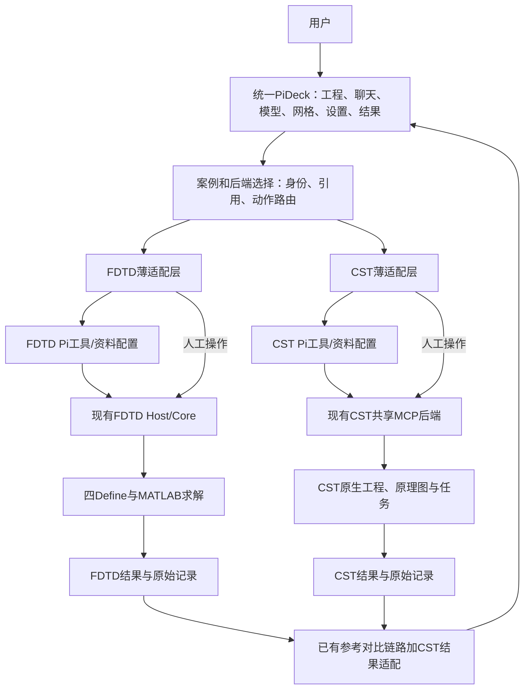

# FDTD / CST 未来合并预案

文档编号：EM-INTEGRATION-I0；版本：0.1；日期：2026-09-22。

**状态：PLANNING_ONLY。用户明确现在不合并；本文件不授权合并代码、安装组件、迁移会话、升级运行时、连接新工程或运行双求解器。**

这是一份未来集成专项方案，不替换两套Agent各自总方案。当前放在CST文档包中便于讨论；未来实际合并启动时，由独立集成项目维护唯一实施版本，此处保留来源链接，不维持两套可写“最新方案”。

## 1. 目标和当前事实

目标是一个统一PiDeck工作台管理两种后端：用户可使用FDTD、CST或在满足比较条件时查看两者结果。先统一入口、元数据和展示，保留各自实际模型与求解链。不是把两套物理模型自动变成同一种脚本，也不构建第三个通用建模Agent。

| 组件 | 本轮核验基线 | 可复用基础 / 证据范围 |
|---|---|---|
| CST控制与文档 | `feat/cst-agent-case-reproduction @ 98423b4b414c998e7b86a2a2499080dcc8267393` | 共享会话后端、真实工程读回、手动/Agent交接、保存版本与目录；新网格/求解暂停 |
| CST独立桌面 | manifest上游 `1979f98d7cab86bd627c1c386f954ae5e0e64fdd`，桌面提交 `a430d299ba391717d82b819d241dd51ae15b6aba` | PiDeck 0.7.1基线上的3个公开patch；本轮没有把patch套入FDTD |
| FDTD | `experiment/m2-calibration-semantics-v1-4 @ 834e89aee20a0d36bb07068b4451613316d8967a` | Code First四Define、Host/Core、模型/实际网格、结果、报告；最新文档还有参考对比和CPU/GPU选择 |
| FDTD参考对比 | 上述提交的`docs/acceptance/参考数据对比验收-20260921/总览.md` | 已有CSV/TXT/Touchstone/部分场数据和解析参考的工程验收记录；不是CST/FDTD已联合验证 |

上述是固定时间点的审阅，不代表活动窗口当前版本或所有能力已实测通过。真正开工前必须重新核对两边HEAD、dirty、运行入口和原始证据，不能直接采用旧聊天SHA覆盖新代码。

**对上轮思路的重要更新：** FDTD已有参考数据对比功能，应评估复用它，不能再从零建设平行的CSV/Touchstone读取和曲线对比系统。文档中的同源数据回环通过，不等于两种求解器的独立物理一致性。[F1、F2]

## 2. 以后应该在哪个 Codex 项目发合并指令？

### 当前

现在的工作继续发给**现有CST项目/会话**：案例学习、专业能力、CST功能和本预案补充。不要把同一份“全面合并”指令同时发给两个正在开发的会话。

FDTD项目继续自己的已批准任务。当前不要求为合并做预先抽象、改目录、升级或复制生产代码。

### 未来获得合并批准时

建议新建一个名为 **“电磁工作台整合”** 的Codex项目和单独主会话，指定为唯一集成负责人。示例目录为`<独立集成目录>`；如果采用`D:\EM-Workbench-Integration`，这是建议名称，不是本轮已创建的路径。

此项目使用独立checkout/worktree。建议优先以已冻结的FDTD桌面作为工作台宿主候选，将CST组件与服务适配进来，因为FDTD已有结果对比等可复用产品能力；最终根据两套实际基线差异确认，不能仅凭项目名决定。

独立项目不必等于新增第三个永久代码仓库：先在宿主仓库建立明确的集成分支并使用独立工作目录即可。只有许可、发布或职责拆分确需另仓时再决策。

| 角色/会话 | 负责 | 不负责 |
|---|---|---|
| 集成主会话 | 总计划、公共UI、映射/适配、冲突、验收及跨仓版本清单 | 在两个生产目录同时自由改动 |
| FDTD原会话 | 后端能力交接、被明确分配的FDTD修复 | 未经协调修改公共集成入口 |
| CST原会话 | CST API/项目/数据交接、被分配的CST修复 | 同时再建设另一套统一工作台 |
| 用户 | 确认共同案例、体验、范围与必要预算 | 手工复制大量聊天或安排每个小测试 |

不依赖“两个会话应该记得彼此工作”。交换物是固定版本接口清单、数据样例、已知限制和提交SHA。若集成主会话可以只读取得信息，就不为交接再要求用户重复回答。

## 3. 目标架构



图中的“两种Pi配置”指保留后端专用资料、工具和会话作用域，不强制同时跑两个模型。普通任务只激活选中的后端；联合比较显式创建两个子任务，不自动把每句话广播两边，也不把两份原始聊天合成伪造的一条连续记录。

手动按钮不需要LLM转发。集成只统一可见交互与能力声明，后端内部保留既有受控执行路径，不为了形式整齐把FDTD HTTP/Core强行改成MCP。

## 4. 统一什么，不统一什么

| 统一对象 | 保持独立对象 |
|---|---|
| 案例ID、前端工程选择、会话导航、文件入口 | FDTD任务ID、CST工程/实例/会话ID；通过映射关联 |
| 打开、保存、读取、修改、结果选择等通用交互 | 四Define与.cst/依赖目录的实际存储格式 |
| 参数依据和改动状态的显示语言 | 各自网格、材料、边界、端口与数值实现 |
| 操作/运行/结果身份的顶层字段 | FDTD推进状态、CST 3D/DS子任务与详细日志 |
| 曲线叠图、比较条件和差异展示 | 原始数组、参考约定和未经转换的文件 |
| 失败、未知、过期和人工运行的标识原则 | CST特有的Cable/原理图，FDTD特有的Define与Yee信息 |

模型与求解器不要求能力完全对称。没有原理图能力的FDTD任务不显示一个假的电路编辑器；CST尚未导出的真实网格不以STL线框替代。后端能力缺失用可识别状态和原因表示。

## 5. 首先需要的最小契约

以下是未来契约草案，不要求本轮实现，字段名可由实际代码审查后调整。

### 5.1 案例映射，而不是新的建模DSL

`CaseLink`至少包括：统一case_id、backend类型、各自session/task/project引用、native工程清单、当前model_revision、已确认物理条件的引用、输入/文件hash及数据保密级别。

“对比条件表”记录用户要比较的物理问题，不直接生成几何，不替代两个后端的真源。由两个实际工程读回确认条件，而不是比较两段自然语言是否一样。

### 5.2 薄的后端适配

`capabilities`、`open`、`read_snapshot`、`apply_edit`、`save`、`list_runs`、`read_result`作为逻辑操作族；未来批准运行时才增加/启用`prepare_mesh`、`start`、`stop`。它们映射到现有后端，不需要完全重写接口。

所有有副作用的操作带backend、case/session、native目标与预期版本。相同operation_id的重试必须与同一内容匹配。UI晚返回不得覆盖新选中的工程。状态查询错误不能降成“未运行”。

### 5.3 结果适配

优先复用FDTD现有结果/参考资产结构，并为CST添加导入器。最小字段：来源后端与实际求解器、模型revision、run_id、原生结果集/任务/扫参点、观测量、轴/单位、复数表示、端口/分量/参考面/正方向、完整性、人工或Agent来源及原始文件hash。

不要重新编号后丢失原生身份。CST的3D结果与Design Studio结果分别适配；手动运行导入必须明确来源，文件时间新不等于自动证明条件匹配。

## 6. 数据目录与会话迁移

第一阶段不迁移两套已用工程目录、JSONL或PiDeck内部数据库。统一工作台建立目录引用及身份映射，提供一键打开原生目录；用户批准复制后才建立成对案例副本。

概念上的集成案例目录：

```text
<集成案例根>/<case_id>/
    阅读入口.md
    case-link.json          # 双后端ID与物理条件引用
    FDTD/                   # 独立原生任务/安全副本或明确引用
    CST/                    # 完整.cst及其配套目录/安全副本
    对照分析/<comparison_id>/
    过程与证据/
```

不要强制用软链接或扁平移动文件实现以上布局；CST依赖目录、FDTD真源和会话身份保持各自要求。先复制后核验，原件与失败记录保留，活动运行不移动。公开Git仅保存代码/方案/脱敏manifest，不上传凭据、原生工程或受限帮助全文。

## 7. 结果对比的有效性检查

### 7.1 共同物理条件

比较前核对尺寸/长度定义、单位和坐标、材料频率模型、导体与回流、激励方向/幅度/波形、端口/负载、观测位置/分量和对比范围。

例如CST Cable的传输线/场路混合模型与自研FDTD细线模型并不自动相等。允许有意的不同建模方法比较，但必须列出差异，不能写成严格同模型数值误差。

### 7.2 不追求相同网格

两边保留各自离散方法。未来有数值运行授权时分别检查分辨率、时长、边界或适应性等影响；不以相同单元数作为物理等价的证明。必须报告CST实际求解方法，不只写软件品牌。

### 7.3 先判可比，再计算差异

沿用FDTD当前对比链路对量、单位、共同区间及版本的检查。数值曲线允许明确记录的插值，但不外推，不为重合偷偷平移时间、拟合幅度或改变参考阻抗。相位、深零陷及接近零的参考值需要适合的比较指标。

不具备可比条件时仍可显示两条来源明确的参考曲线，但标为“条件未对齐，不能计算同条件误差”。任何一个后端都不默认充当绝对真值；同源回环、一致性验证和独立物理验证分别登记。

## 8. 未来实施顺序（现在不执行）

| 阶段 | 内容 | 可以收口的标志 |
|---|---|---|
| I0 文档预案（当前） | 当前基线、架构、分工、契约、风险与交接说明 | 用户能理解以后在哪启动；未改两套运行系统 |
| I1 已有结果导入比较 | 在独立副本评估复用FDTD参考链路，先导入少量来源明确的CST数据 | 原始数据、单位和版本不丢；不可比情况明确拒绝；不需要新求解 |
| I2 统一外壳 | 在独立宿主分支增加CST入口、面板和后端路由 | 两个后端仍可独立打开；人工/Agent操作不串工程 |
| I3 双域交互回归 | 模型、设置、保存、重开、目录、失败/断线恢复 | 两套原有关键验收不退化；不要求CST与FDTD界面完全相同 |
| I4 共同案例数值比较 | 用户另行批准后，选择真实等价的共同案例及预算 | 两边新结果可追溯、条件和误差可解释；独立参考范围明确 |

I1只用已保存结果验证导入功能时，若没有同条件两组数组，不能把图表显示通过写成跨求解器复现通过。I4候选可从已掌握的简单偶极子、简化孔缝空腔或现有可比问题中选择；完整222继续保留为CST主案例，不强迫它成为第一个跨后端算例。

初期不并发启动两个高资源任务。CST暂停策略与FDTD已有网格/CPU/GPU授权独立，切换后端不能把一边的授权带入另一边。新计算、更高资源和自动优化另行确认，当前不申请。

## 9. 合并时怎么处理源码

1. 集成主会话先取得两边真实接口、文件级差异和锁定版本，保存已有baseline与回滚入口。
2. 在独立宿主checkout开展集成。当前CST的3个patch以原版PiDeck为基线，FDTD已有定制修改；不能无检查直接`git am`到FDTD生产目录。
3. 按文件/职责迁移CST UI与主进程桥接，保留FDTD现有会话、目录、结果对比和CPU/GPU能力。不同状态/类型通过小适配层映射，不全面抽象多物理平台。
4. CST控制包仍在原仓库迭代；集成分支锁定其已验版本/接口。确需后端修改时分配给对应原会话，合入后同步版本清单，避免两边同时改公共文件。
5. 测试通过后先提供独立集成版入口。保留两套原应用可运行；正式切换和默认配置修改需要用户确认，不强制升级全局Pi环境。
6. 对依赖许可、原生库分发和公开范围先登记审查事项，不能直接打包受限CST库和工程发布。

## 10. 最小验收与回滚

内部测试由Codex安排，不由用户逐条审批。完整记录：代码/运行基线、输入、失败、修复、兼容差异和最终证据。

验收至少包括：后端切换不串任务；同名对象不跨工程修改；Provider错误不妨碍只读查看/保存和已支持控制；旧结果不冒充当前；保存重开身份一致；一端失败不改写另一端产物；正常刷新不触发计算；现有目录入口与历史失败记录可访问。

出现生产目录可能被改、会话混淆、无法恢复的文件迁移或授权扩张时停止相关操作并保留现场。回滚首先回到独立集成版的上一个提交/配置，不要求重置原CST/FDTD生产工程。

## 11. 当前还需要确认什么？

以下保留到实际启动集成时，不阻塞当前CST学习开发：宿主确切基线、两端实际Pi/SDK入口、对比资产模型的代码位置、依赖兼容、CST真实网格出口、DS结果语义、CST任务停止能力、共同案例与预算、可公开发布范围。

没有要求现在把这些全部实现。当前推荐行动仍是：在CST原会话完成一个简单串扰学习案例和专业资料/工具闭环，继续保护FDTD独立工作线。

## 12. 未来集成主会话开场模板（现在不要执行）

> 本任务为用户已批准的独立集成任务。先读取本预案和两仓当前交接材料，在独立工作区冻结宿主与后端版本。你是唯一集成负责人；两原会话负责各自后端，不并行修改公共入口。先复用已有FDTD结果对比并接入CST原生数据，再集成工作台；不迁移/覆盖生产会话，不统一物理模型格式，不自动启动新计算。完成只读评估后按本次明确授权范围实施；缺少实际合并授权时停在预案，不能从本模板推断批准。

## 13. 参考依据

- C1 [CST W3基线](https://github.com/guardianer9-debug/cst-studio-orchestrator-mcp/tree/98423b4b414c998e7b86a2a2499080dcc8267393)
- C2 [桌面集成manifest](https://github.com/guardianer9-debug/cst-studio-orchestrator-mcp/blob/98423b4b414c998e7b86a2a2499080dcc8267393/integrations/pideck/manifest.json)和同目录README/patches
- C3 [共享后端](https://github.com/guardianer9-debug/cst-studio-orchestrator-mcp/blob/98423b4b414c998e7b86a2a2499080dcc8267393/src/mcp_cst_studio/workbench_service.py)
- F1 [FDTD本轮核验基线与状态入口](https://github.com/guardianer9-debug/fdtd-agent-pideck/blob/834e89aee20a0d36bb07068b4451613316d8967a/AGENTS.md)
- F2 [FDTD参考数据对比验收](https://github.com/guardianer9-debug/fdtd-agent-pideck/blob/834e89aee20a0d36bb07068b4451613316d8967a/docs/acceptance/参考数据对比验收-20260921/总览.md)
- U1 用户2026-09-22本轮要求：现在不合并，只写计划；明确以后由哪个Codex项目负责，继续学习CST案例与架构。

本轮只写方案，不创建集成代码目录、实际比较任务或新Agent。后续真实决策与实施结果应回写本预案及唯一总方案对应章节，保留旧版本依据。
