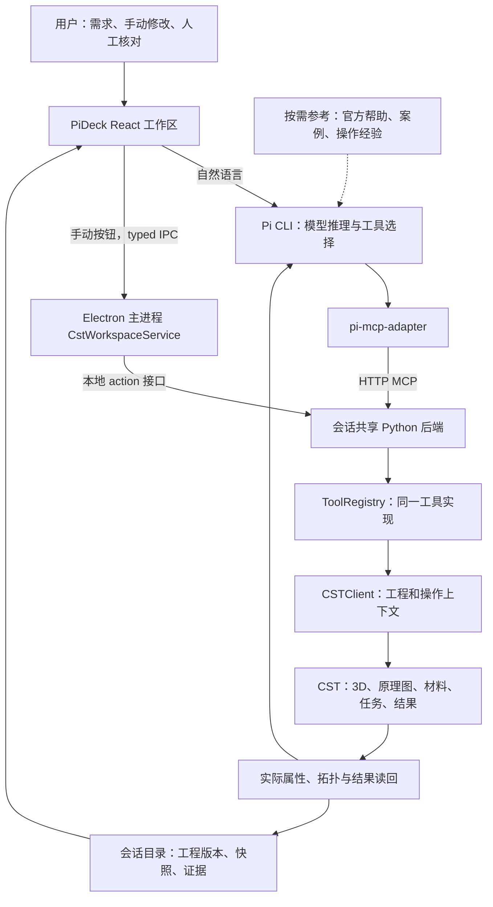

# CST Agent 技术栈、专业能力与案例学习导览

版本：L1 / 2026-09-22。性质：基于源码与已有记录的学习说明，不是新的总架构或功能验收。

核验基线：CST `98423b4b414c998e7b86a2a2499080dcc8267393`；FDTD `834e89aee20a0d36bb07068b4451613316d8967a`。CST 原总方案继续由 `architecture-and-delivery-plan.md` 维护。

当前约束：CST/FDTD继续独立开发；合并只做预案；CST暂停新增网格、task执行和求解的要求继续有效。学习和文件核验不应隐式触发仿真。

## 1. 应该先学完 CST，还是一边开发一边学？

建议采用“一个完整案例，一次学习与产品迭代”。不先系统学完 CST 全部菜单，也不让 Agent 在用户完全看不懂的领域无限试错。

学习顺序是：看懂一个有来源的模型 → 理解激励、回流、端接和观测 → 人工修改一个关键条件 → 让实际产品 Pi 完成同类操作 → 检查一个新结构/新命名变体。需要数值结果时，由用户手动运行或另行明确运行授权。

用户主要负责理解物理问题和验收代表性工程。内部单元测试、接口探测、异常注入和重试由 Codex 自己安排并保存，不要求用户逐项批准。

用户对软件的人工核对很重要，但仅目视认可不能代替独立物理参考；没有新运行时，结论限于模型、配置、保存和交互。

## 2. 当前软件实际上用了哪些技术？

| 层 | 已核到的技术/实现 | 通俗解释 | 依据 |
|---|---|---|---|
| 桌面外壳 | PiDeck；Electron、Node.js | 提供窗口、项目、会话和文件访问；不是 CST 自己的界面 | S1、S2 |
| 前端 | React、TypeScript，Electron 主进程/预加载 typed IPC | 中央工作区、属性、按钮；通过受控桥接访问后台 | S2、S3 |
| 当前中央模型显示 | Canvas 2D 对真实 STL 三角坐标进行正交投影；W3 增加选择/隐藏/透明与线缆检查 | 可以转动、缩放和选对象，但不是嵌入 CST 原生视口，也不是求解网格 | S3、S4 |
| 当前原理图/曲线 | React + SVG；读回元件、Net和属性后绘制 | 连接来自真实工程；显示布局可以派生，不等于复制原生编辑器 | S3、S4 |
| 产品 Agent | Pi CLI，PiDeck 通过 RPC 管理；记录版本为 0.85.1 | 读取需求、调用模型和工具、继续同一会话 | S2、S5 |
| MCP 适配 | `pi-mcp-adapter`、项目扩展、按需发现工具 | 帮 Pi 找到和调用 CST 功能 | S5 |
| 共享本地后端 | Python、MCP Python SDK、Starlette、Uvicorn；loopback HTTP | 桌面按钮和 Pi 共享同一会话的 CSTClient、编辑入口和锁 | S6 |
| CST 控制 | 官方 `cst.interface` / `cst.results` 与 VBA；封装和明确的通用入口 | 真正打开工程、建模、修改电路、读参数及取已有结果 | S6、S7 |
| 原生数据与记录 | `.cst`及依赖、JSON、日志、脚本、STL、结果文件 | 每个会话保留完整工程、版本、尝试及证据；不是把所有状态都放在聊天里 | S2、S7 |
| 测试 | Python测试、TypeScript/桌面测试、真实CST与实际Pi检查分层 | 代码通过不自动等于物理结果正确 | S2、S7 |

这张表描述核验到的版本，不推断用户活动窗口此刻加载了同一构建。上游 package.json 的依赖范围不等于本机实际 lockfile 版本。

**特别更正容易混淆的点：** 早期独立结果网页曾用 Three.js；当前公开的中央工作台补丁使用 Canvas 投影和 SVG。不能把旧网页实现、FDTD Three.js 查看器和新的 CST 中央面板混写成同一套技术。将来需要大模型交互性能、切面或更完整的三维显示时可以评估复用 FDTD 的渲染经验，但不是现在已经完成。[S3、S4]

## 3. 当前架构图

实线为当前可以从集成代码追踪的主要调用关系；资料如何被实际产品 Pi 自动检索、加载多少，仍须核验实际会话，虚线不表示已具备完整官方知识库。

“共享后端”在当前实现里是**每个会话内**手动与 Agent 共享，不等于所有会话强行共用一个 CST 实例。不同会话对同一工程的竞争也需要拒绝或协调，不能因为图简化了就忽略。

### 3.1 一次修改如何走完整链路

以“修改一个端接电阻”为例：

1. 用户点属性面板，或 Pi 理解自然语言；两条路径最终进入共同编辑入口。
2. 后端核对当前会话、工程和预期版本；读取真实旧值。
3. 调用 CST 原理图对象的属性方法，并保存独立版本。
4. 再读取实际值和连接关系，确认修改没有错误影响其他内容。
5. 新版本写入会话索引，PiDeck 跟随显示；旧结果不能冒充新版本结果。
6. 参数解释同时保留“为什么取这个值”的来源，与“实际读到什么”分开。

W3 对 222 和偶极子有这一交接流程的开发者验证记录；不能外推所有器件和操作均已验收。[S7]

## 4. 如何让 Agent 拥有专业 CST 能力？

不是给模型安装 MCP 后就自然成为仿真专家，也不是界面按钮越多专业性越高。

### 4.1 专业能力由五部分配合

| 部分 | 应提供的内容 | 当前可确认/待补 |
|---|---|---|
| 电磁与案例理解 | 激励、回流、端接、参考阻抗、观测量；哪些参数是输入、哪些是建议 | 通用模型可推理，但要用来源与人工核对约束，不能凭语言自信签收 |
| 同版本官方依据 | 方法签名、单位、顺序、支持模块、许可证/工程前提 | 旧记录显示 Codex 查过本机帮助；生产Pi完整检索闭环仍需单独确认 |
| 工具与代码 | 复用可靠封装；允许组合 Python/VBA 和已批准通用操作 | 已有MCP及Python/VBA控制；不等于任意代码沙箱或所有API均验证 |
| 真实反馈 | 对象/参数/端口/网络/任务读回、求解日志、结果来源 | W3有部分实际验证；源码与验收范围对应，不外推全套能力 |
| 测试与经验 | 最小成功例、失败反例、修复条件、未见过的案例 | 现有台账/踩坑记录继续复用；新结构迁移与数值泛化仍需评估 |

当前没有证据说明项目训练或微调了一套专门 CST 模型。可核实的是**在通用模型外面补资料、工具、验证和记录**的路线。也没有依据为了本阶段目标立即建设大型向量库或新的 Agent 框架。

### 4.2 “开发用 Codex 会”不等于“产品里的 Pi 会”

Codex 可能在开发时查了官方帮助、修好脚本；但实际 Pi 未必加载了相同资料和规则。因此每次增加专业能力，都要留下两种不同的证据：固定代码是否能正确操作，真实产品 Pi 是否能自己找到资料并使用它。

建议先为一个选定案例建立小而明确的资料包：官方章节定位、参数与单位表、输入完整性检查、正确调用配方、真实读回检查、常见失败与适用条件。复用已有项目指令/Skills，没有才补一份薄的专题说明，不无限增加必读文件。

当前 `cst_vba_help` 仍然读取仓库 `data/vba_reference.json`；它不是实时遍历 CST 官方全部手册。运行时成员枚举也不提供完整的参数语义。资料摘要必须标明“官方来源”“项目总结”“实机已验”三者区别。[S8]

### 4.3 专业化不等于把单个案例写死

允许共享 API 配方与教材参考，不应将测试案例的完整坐标答案、固定对象名和成功曲线埋进通用规则。至少增加一个改名/改目录的迁移检查，以及一个有真实意义的结构变体。开发集用来修；留出的验证案例先测后修，保存第一次失败和之后版本。

## 5. 已有案例从哪里找？

用户上传的旧记录载明：本地曾整理29篇文献、4个作者天线CST文件和3个作者CST相关文件，并检查过安装目录里的Cable示例。这是**历史记录**，本轮未访问用户磁盘确认文件仍在；不应从零重新大规模搜索，也不把旧统计当作当前可运行数量。

请由本地 Codex 先核对：文献库的“原始工程与案例”索引、原始工程审计、研究资产目录，以及已安装CST的Examples/Documentation。公开文档不写个人绝对路径；本地固定入口返回真实路径。

### 5.1 本轮核对后的候选

| 资源 | 确认有什么 | 适合现在吗？ |
|---|---|---|
| 本机 CST Cable 示例/教程 | 历史记录确认示例数据库与Cable Simulation手册已检查；串扰、双绞线受照射是线索；具体标题和工程完整性由本机重新核对 | **优先**。选一个简单串扰例作为学习＋泛化交付，不默认全部官方案例都已完整可运行 |
| Andreas Barchanski 的 Cable Simulation 教程 | 作者说明从空模型建立串扰问题，并观察不平衡、长度不匹配和屏蔽的影响 | 辅助学习，原生工程可下载性未在本轮确认；不是CST全套课程 [E1] |
| SDU / Viet Duong Hoang 模型包 | 发布页列出3个CST文件，版本标记Academic 2023；其中2个是电容估计，**仅1个是无人机内部线缆干扰模型** | 有作者原工程，适合后续阅读迁移，不宜把高压放电建模作为第一堂学习任务 [E2] |
| AEG Box Test Suite | 金属腔体、可替换前板、直/弯导线、线束、规格、Gmsh .geo CAD和部分实测数据 | 与腔体线缆方向相合，适合以后有独立参考的验证；本轮未确认即开即用CST工程 [E3] |
| 旧库的Vivaldi作者工程 | 历史记录说下载过4个.cst；本轮未重新核对全部资产 | 保留为更复杂天线候选，不要求只做过偶极子的用户现在就验收 |

SDU 文件分别是 `BoxCapacitance.cst`、`DroneCapacitance.cst`、`Journal_Drone_Spark_Sim.cst`。后者才对应线缆干扰；页面也提供放电源估计的Simulink文件。论文的放电实验不自动证明所有机内线缆电压结果都有独立实测。[E2、E4]

作者开放模型、官方安装附带案例、开放测量数据、第三方复现是四种来源，不合称“开源CST基准”。使用前核对许可、依赖、工程版本、波形和参考曲线；小文件体积也不代表求解一定便宜。

## 6. 建议的下一次交付：一个能看懂的新线缆串扰案例

推荐名称：“CST学习与泛化首例——简单线缆串扰”。不修改原222基线，不启动合并。

### 6.1 先交给用户的一页案例卡

卡片回答：这个案例想研究什么；哪条是主扰线/受扰线；电流从哪里返回；两端接什么；激励是什么；观察哪一端、什么量；哪些条件来自官方；哪些尚未确认；用户该从哪些界面核对。

所有数字从选定工程/官方材料提取。缺失项如实标记，不能为了开工随意填。提供原生CST手工查看步骤、工作台中对应位置和真实文件入口。读懂卡片不需要先学完所有电磁理论。

### 6.2 建模与交互目标

Codex先核对选定原例，再让**实际产品Pi**建立或复现一个独立工程。保留元件、端口、线缆、参考节点、激励和观测的读回表。

在原例基础上先做一个参数变化，再做一个结构变化；具体从当前可靠接口能支持的变化中选择，例如端接方式或路径。不能将“改两个电阻值”当作全部结构泛化。未经来源和适用条件确认，不把某个变化对串扰的趋势说成处处成立的定律。

本轮结果可以停在用户可用原生 CST 打开、检查并准备手动运行的工程。保留当前不自动网格/求解策略；涉及Cable等效模型提取也要辨别是否实际计算，不以“刷新”名义绕过。

### 6.3 什么才算交付

用户拿到一页解释、完整原生工程、PiDeck中的模型与原理图、一次人工与Agent交接修改、保存重开、会话目录和全部测试记录。数值未运行单列，不冒充“串扰曲线验证通过”。接口不足时，Codex自主补当前案例真正需要的通用能力，不先做整套全按钮编辑器。

如果官方串扰工程暂时不完整，先交付资源缺口和可行替代候选，继续已获准的资料/界面工作；不暗中切成复杂无人机或大型222重算。

## 7. 在哪里学习和看代码？

建议阅读顺序：本导览 → `overview.md` → 总方案第5–10节 → `integrations/pideck/README.md` → 源码入口。

| 文件/目录（相对各自仓库） | 建议看什么 |
|---|---|
| `docs/cst-agent/architecture-and-delivery-plan.md` | 唯一总方案；架构、数据、权限、运行、测试和交付 |
| `integrations/pideck/manifest.json` 与3个patch | 当前桌面基线、实际组件和主进程桥接；不是FDTD补丁 |
| 桌面 `src/renderer/src/features/cst/CstSessionWorkspace.tsx`、`CstVisuals.tsx` | 视图、属性、真实STL投影、SVG拓扑/曲线 |
| 桌面 `src/main/cst/CstWorkspaceService.ts`、`src/main/ipc/cstIpc.ts` | 手动操作怎么找到会话并访问后台 |
| `integrations/pideck/cst-mcp.example.ts` | Pi如何绑定同一会话后端，而不是另开工程 |
| `src/mcp_cst_studio/workbench_service.py` | 本地服务和共享CSTClient/工具注册 |
| `src/mcp_cst_studio/session_workspace.py` | 会话、工程版本、文件和只读目录入口 |
| `src/mcp_cst_studio/cst_client.py`、`tools/` | 真实CST读写与具体功能 |
| `delivery-evidence.md`、`pitfalls.md` | 已经验到什么、失败怎么修、哪些还不确定 |

桌面目录相对路径来自固定PiDeck基线的patch；在FDTD仓库里相应代码通常在`desktop/`下面，不能机械套用路径。用户磁盘上当前CST实现checkout与文档worktree的真实绝对路径应由Codex核验并提供，本轮远端阅读不能证明它。

## 8. 来源

所有网页/源码核验日期：2026-09-22。官方教程与文献资料仅链接，不上传原文或受限工程。

- S1 [PiDeck固定上游 package.json](https://github.com/ayuayue/PiDeck/blob/1979f98d7cab86bd627c1c386f954ae5e0e64fdd/package.json)
- S2 [CST桌面集成说明](../../integrations/pideck/README.md)及[manifest](../../integrations/pideck/manifest.json)
- S3 [首个工作台补丁](../../integrations/pideck/0001-session-workbench.patch)
- S4 [交接补丁](../../integrations/pideck/0002-workbench-handoff.patch)及[引脚补丁](../../integrations/pideck/0003-schematic-pins.patch)
- S5 [Pi MCP扩展示例](../../integrations/pideck/cst-mcp.example.ts)
- S6 [共享后端](../../src/mcp_cst_studio/workbench_service.py)
- S7 [当前交付台账](delivery-evidence.md)、[功能矩阵](capability-matrix.md)
- S8 [VBA参考读取](../../src/mcp_cst_studio/tools/vba.py)
- E1 [教程作者原始介绍](https://www.linkedin.com/posts/andreasbarchanski_cst-tutorial-cable-simulation-activity-7068978945764806657-ObDA)
- E2 [SDU作者模型包及CST文件说明](https://zenodo.org/records/15770221)
- E3 [AEG Box Test Suite作者仓库](https://github.com/flintoftid/aegboxts)
- E4 [SDU论文条目](https://portal.findresearcher.sdu.dk/en/publications/modeling-electric-spark-discharges-on-drones-in-contact-with-high/)，DOI 10.1109/TPWRD.2025.3606346
- U1 用户本轮提供的Codex历史会话：案例资源与本地文献库的历史证据；不在公开仓库复制原始会话或个人路径。

本说明的学习顺序、资料包和新案例交付属于建议，不是来源文档已经实现的功能。[未来合并预案](future-fdtd-integration-plan.md)单独维护，仅规划，不实施。
